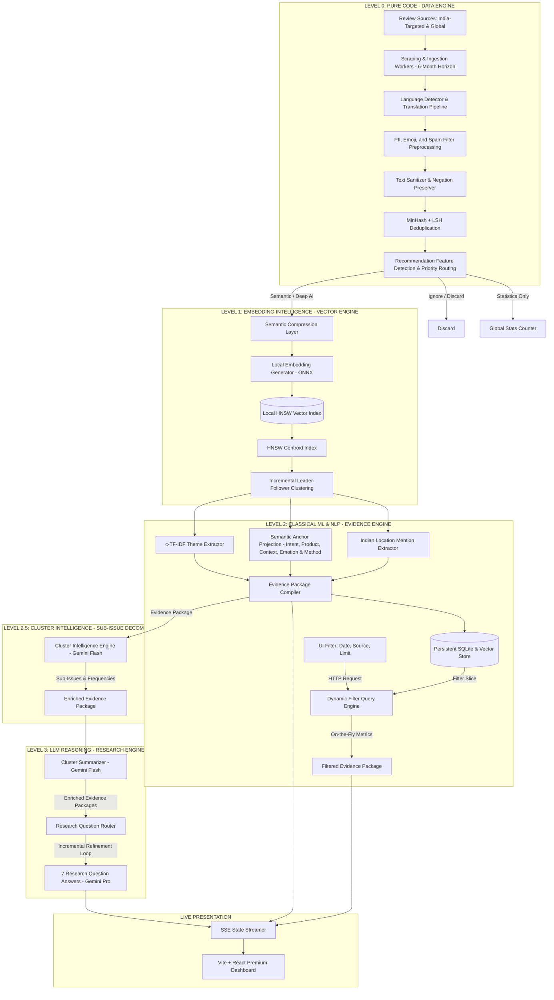
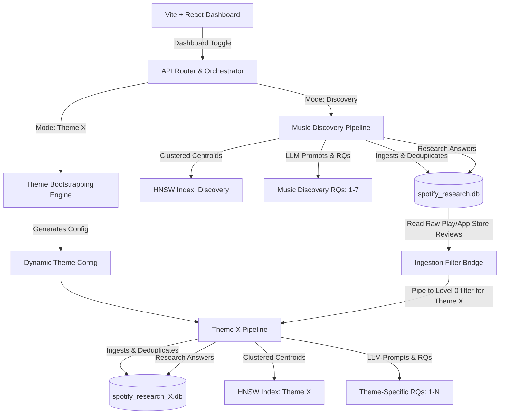

# Architectural Blueprint: Spotify AI Product Research Engine (Music Discovery & Context Focus)

This document defines the production-grade, highly scalable system architecture for the **Spotify AI Product Research Engine**, specifically optimized to analyze **music discovery behaviors, playlist-based discovery friction, and physical listening contexts**. Designed by a Principal AI Systems Architect, this system is engineered to ingest, process, and analyze 10,000+ reviews and discussions, transforming raw multilingual text into structured, actionable product intelligence.

---

## 1. System Architecture Overview

The system is structured around **Four Intelligence Levels**, separating pure algorithmic execution from expensive LLM reasoning. Below is the end-to-end data flow:



### Dual-Mode & Multi-Tenant Topology
To support custom theme exploration without risk of data contamination to the core discovery metrics, the engine can transition between **Music Discovery Mode** (Mode 1) and **Theme Exploration Mode** (Mode 2), routing data through completely isolated states:



---

## 2. The Four Intelligence Tiers

To maximize performance, scale to 10,000+ reviews, and minimize AI costs, we enforce a strict separation of concerns across four execution tiers, augmented by a lightweight intermediate intelligence stage:

### Level 0 — Pure Code (The Data Engine)
* **Operations**: Concurrent ingestion (India store focus, 6-month horizon), language detection, translation of regional Indian languages to English, PII and noise preprocessing, text sanitization, MinHash + LSH near-duplicate detection, and priority routing.
* **Execution**: Local CPU-bound, highly optimized Python/C++ code. Zero vector or LLM calls.
* **Impact**: Standardizes all inputs to English and filters out PII, emojis, spam, and low-information reviews before vectorization, protecting downstream stages from noise.

### Level 1 — Embedding Intelligence (The Vector Engine)
* **Operations**: Dense vector generation, HNSW indexing, and real-time Leader-Follower clustering.
* **Execution**: Local embedding models (`all-MiniLM-L6-v2` via ONNX Runtime) and in-memory C++ HNSW indexes.
* **Impact**: Maps reviews to a continuous semantic space in $O(\log N)$ time, enabling meaning-based grouping.

### Level 2 — Classical ML & NLP (The Evidence Engine)
* **Operations**: Class-Based TF-IDF (c-TF-IDF) theme extraction, Semantic Anchor Projection (SAP) for implicit intent, discovery method, emotions, and listening context extraction, Indian Location Mention Extraction, metric aggregation, and mathematical scoring.
* **Execution**: Vector mathematics (NumPy), geographical dictionary matching, and statistical calculations.
* **Impact**: Compiles raw reviews, location mention distributions, listening contexts, and vector states into a highly structured **Evidence Package** with zero LLM overhead. Handles on-the-fly filtering for the interactive dashboard. Note that extracted locations represent textual references within reviews and do not constitute verified user locations.

### Level 2.5 — Cluster Intelligence (Lightweight LLM Pre-Synthesis)
* **Operations**: Sub-issue identification, frequency quantification, representative quote matching, and extraction confidence scoring.
* **Execution**: Single `gemini-1.5-flash` call per cluster on size milestones (triggered for clusters with $N \ge 15$).
* **Impact**: Structurally decomposes a broad cluster into precise, quantified sub-problems (e.g., separating "same 15 songs" from "artist repetition" or "genre echo chamber"), providing the downstream Gemini Pro engine with pre-digested thematic breakdowns without increasing LLM usage per review.

### Level 3 — LLM Reasoning (The Research Engine)
* **Operations**: Root Cause Analysis (RCA), Jobs To Be Done (JTBD) formulation, Unmet Need extraction, and Incremental Refinement of the 7 core Research Questions.
* **Execution**: Gemini API (`gemini-1.5-pro` for global research answers).
* **Impact**: Acts purely as a high-level reasoning and synthesis layer, receiving enriched evidence instead of raw reviews.

---

## 3. Geographic Targeting & Ingestion Routing Policies

### A. Geographic Targeting Policy & Limitations
To ensure academic defensibility and technical accuracy, the system enforces a strict geographic policy across all data sources:

1.  **Platform-Supported Targeting (India-Focused Storefronts)**:
    *   Where reliable geographic targeting is supported by the platform, we collect reviews from the Indian storefront using the appropriate country parameter (`country='in'`).
    *   *Google Play Store India*: Targeted using `country='in'`. Public Google Play reviews do not expose reviewer-country metadata; hence, storefront targeting retrieves reviews listed on the Indian storefront but does not guarantee reviewer nationality or physical location.
    *   *Apple App Store India*: Targeted using `country='in'`. Reviews are retrieved from the Indian storefront feed, but reviewer nationality or physical location is not verified.
2.  **Global Behavioural Sources (Supplementary Evidence)**:
    *   Where reliable geographic targeting is not supported by the platform—specifically **Reddit, Spotify Community, and YouTube**—the system does not attempt to infer or claim reviewer nationality.
    *   These global sources are included as supplementary behavioural evidence because they provide valuable product feedback and behavioural insights that are highly relevant to our research questions, regardless of the user's physical location.

### B. Streaming Producer–Consumer Pipeline & Language Policy
To maximize ingestion throughput and achieve real-time streaming, we implement a **decoupled, event-driven producer–consumer pipeline** using asynchronous queues:
1.  **Streaming Scrapers (Producers)**: All 5 source scrapers run concurrently as async tasks. Instead of waiting for scraping to complete and returning a monolithic list, each scraper yields and pushes raw reviews into a shared `raw_queue` immediately as they are scraped (e.g. page-by-page, post-by-post, or video-by-video).
    *   *YouTube Comments Pagination & Date-Windowing*: The `YouTubeCommentsScraper` paginates using `nextPageToken` from the YouTube API with `order="time"` (newest first). It enforces strict comment-date windowing: comments newer than `to_date` are skipped, and the scraper immediately stops paginating for a video the moment it encounters a comment older than `from_date`, conserving API quota.
    *   *Hybrid Video Search*: To target comments, the system performs a dual-search query: one by `relevance` (to capture high-traffic popular videos acting as community hubs) and one by `date` (to capture newly uploaded videos discussing recent updates).
2.  **Parallel Preprocessing Worker Pool (Consumers)**: A pool of 4 concurrent worker tasks consumes raw reviews from `raw_queue` in real-time. Each review is immediately processed through:
    *   *Text Cleaning & Normalization*: Standardizing text, stripping HTML, and removing PII/noise.
    *   *Early Language Filtering*: Checking the original language against our **strict Indian-market language policy** (English, Hindi, Hinglish, or Indian regional languages like Tamil, Telugu, Kannada, Malayalam, Marathi, Bengali, Gujarati, Punjabi, Urdu). If a review matches, it proceeds; otherwise, it is discarded. Language filtering is a relevance filter and does not verify physical location or nationality.
    *   *Real-time Deduplication*: Comparing review IDs against an in-memory set of existing database IDs (loaded at startup) for $O(1)$ duplicate prevention, and checking MinHash/LSH for near-duplicates.
3.  **Asynchronous Batch Translation**: Non-English reviews are pushed to a `translation_queue`. An independent translation worker drains this queue, batches requests (up to 20 texts), and translates them concurrently via `GoogleTranslator().translate_batch()`, setting the result on an async future to resume the preprocessing worker.
4.  **Asynchronous Batch Database Writer**: Successfully preprocessed reviews are pushed to a `db_queue`. An independent database writer worker drains the queue and commits records to SQLite in batches of up to 50 (or every 200ms), ensuring high database write performance without blocking scraping or preprocessing.
5.  **Optimized Checkpointing**: At startup, the pipeline queries all existing review IDs from SQLite and stores them in a set, ensuring that already-ingested reviews are skipped at the very first gate without redundant processing.
6.  **Indian Location Mention Gazetteer**: The preprocessing workers match text tokens against an Indian Gazetteer to extract textual location mentions. These are references within the text and do not represent verified physical user locations.

### C. Text Preprocessing & PII/Noise Removal
Before text sanitization and embedding, the incoming text passes through a regex and heuristic-based preprocessing filter:
1. **PII Removal**: Strip email addresses, phone numbers, URLs, and social media usernames (e.g., `@handle` or `u/username`) to protect user privacy.
2. **Emoji Stripping**: Emojis are removed to clean the text, while punctuation relevant to sentiment (like `!`, `?`) is preserved.
3. **Promotional & Spam Filtering**: Identify and filter out spam-only text (e.g., app reviews containing promo codes, link-sharing spam, and repetitive bot-like texts).
4. **Length-Based Exclusion**: Calculate the number of meaningful words (excluding stop words and punctuation). If a review has **fewer than 3 meaningful words** (e.g., "nice app", "good", "waste"), it is excluded from semantic analysis and routed to `Ignore` (or `Statistics Only` if a rating is present).

#### D. Recommendation Feature Detection & Priority Routing
To ensure no valuable feedback on Spotify's core recommendation products is lost, any review containing the following keywords is **automatically upgraded** to `Semantic Analysis` or `Deep AI Analysis` (bypassing the `Ignore` and `Statistics Only` filters):
* `"Discover Weekly"`
* `"Discover"` (in the context of music discovery)
* `"Release Radar"`
* `"Smart Shuffle"`
* `"Daily Mix"`
* `"Recommendations"` / `"Recommend"`
* `"Home Feed"` / `"AI DJ"` / `"Algorithmic"`

> [!NOTE]
> **Clarification**: This keyword-based routing rule is used **strictly for filtering and routing** at the ingestion gate to prevent valuable feedback from being discarded as noise. Once routed, the actual deep analysis, theme extraction, and categorization are performed entirely by semantic embeddings, HNSW clustering, and the Level 2/3 Evidence Engine. No keywords are used to bias the final clustering or LLM synthesis.

### E. Two-Phase Ingestion Strategy (Random vs. Targeted)
To ensure both statistical baseline validity and deep semantic coverage of music discovery issues, the ingestion pipeline (for Reddit, Spotify Community, and YouTube) operates in two distinct phases:
1.  **Phase 1: Random Ingestion (Non-Targeted Baseline)**:
    *   *Purpose*: Captures a random, unbiased sample of reviews and discussions.
    *   *Operation*: Scrapes the general "hot" or "new" feeds and comments without keyword filters.
    *   *Use Case*: Establishes the true baseline impact and frequency of discovery issues relative to operational issues (e.g., ads, crashes).
2.  **Phase 2: Targeted Ingestion (Discovery-Focused)**:
    *   *Purpose*: Builds a dense, high-volume cohort of reviews explicitly discussing music discovery and recommendations.
    *   *Operation*: Scrapes keyword-targeted search queries (e.g., `"discover weekly"`, `"smart shuffle"`, `"rap caviar"`, `"song repetition"`, `"algorithm"`, `"autoplay"`) across subreddits (`r/spotify`, `r/truespotify`, `r/musicmarketing`), Spotify Forums, and targeted YouTube videos.
    *   *Use Case*: Feeds the detailed clustering path with rich, relevant data to form highly specific semantic clusters on discovery friction.

---

## 4. Semantic Compression Layer

To prevent long-form discussions (e.g., 500-word Reddit posts) from diluting the semantic vector and distorting cluster placement, we introduce an intermediate compression step:

* **Where it sits**: Between **Level 0 (Classification)** and **Level 1 (Embedding)**.
* **Algorithm**: **TextRank (Extractive Summarization)**. We construct a local sentence-similarity graph using TF-IDF, rank the sentences, and extract the top $N$ sentences containing the highest density of product entities and action verbs.
* **Output**: A **Compressed Semantic Summary (CSS)**. Only the CSS is embedded and clustered, preserving the core product feedback while removing 80% of the conversational noise.

---

## 5. HNSW Centroid Index & Clustering Lifecycle

To scale semantic grouping to 10,000+ reviews in real-time, the system avoids naive $O(N^2)$ pairwise comparisons. Instead, it maintains a dynamic **HNSW Centroid Index** (`HNSW_centroids`) containing only the active cluster centroid vectors.

### A. Mathematical Specification
Let $V_r \in \mathbb{R}^D$ be the L2-normalized embedding of a new review $r$ ($\|V_r\|_2 = 1$).  
Let $\mathcal{C} = \{C_1, C_2, \dots, C_K\}$ be the set of active, L2-normalized cluster centroids ($\|C_k\|_2 = 1$).

#### 1. Nearest Centroid Query
The system queries `HNSW_centroids` to find the single closest centroid in $O(\log K)$ time:
$$C_{\text{best}} = \arg\max_{C_k \in \mathcal{C}} (V_r \cdot C_k)$$
The maximum cosine similarity is $S_{\text{max}} = V_r \cdot C_{\text{best}}$.

#### 2. Adaptive Threshold Evaluation
To prevent fragmentation in large datasets while maintaining fine-grained resolution for small datasets, the similarity threshold $\theta_{\text{match}}$ is calculated dynamically based on the total number of reviews $N$ currently being analyzed:

$$\theta_{\text{match}}(N) = \begin{cases} 
0.80 & \text{if } N < 500 \\
0.75 & \text{if } 500 \le N < 1500 \\
0.70 & \text{if } 1500 \le N < 4000 \\
0.65 & \text{if } 4000 \le N < 8000 \\
0.60 & \text{if } N \ge 8000 
\end{cases}$$

This step-wise mapping ensures:
*   **High Granularity** for small datasets (e.g., $N < 500$) to keep clusters tight and highly specific.
*   **Broad Thematic Grouping** for large datasets (e.g., $N \ge 8000$) to prevent excessive fragmentation and keep the number of clusters manageable for LLM synthesis.

*   **Case A (Merge)**: If $S_{\text{max}} \ge \theta_{\text{match}}(N)$, the review is assigned to cluster $k_{\text{best}}$.
*   **Case B (Create)**: If $S_{\text{max}} < \theta_{\text{match}}(N)$, a new cluster $k_{\text{new}}$ is spawned.

Users can explicitly override this adaptive behavior by specifying a fixed, static threshold (e.g., via advanced dashboard settings), which bypasses the $\theta_{\text{match}}(N)$ calculation.

#### 3. Centroid Update & Normalization
Upon merging a review into cluster $k$, the centroid is updated using an incremental moving average and re-normalized to maintain unit length:
$$C_k^{\text{new}} = \text{Normalize}\left( C_k^{\text{old}} + \frac{V_r - C_k^{\text{old}}}{N_k + 1} \right)$$
where $N_k$ is the review count prior to insertion, and $\text{Normalize}(X) = \frac{X}{\|X\|_2}$.

#### 4. Running Variance & Drift Detection
The system tracks semantic drift by calculating the running variance of cosine distances within the cluster using Welford’s algorithm. Let the cosine distance of review $i$ to its centroid be $d_i = 1 - V_i \cdot C_k$.
$$\Delta = d_r - \mu_k^{\text{old}}$$
$$\mu_k^{\text{new}} = \mu_k^{\text{old}} + \frac{\Delta}{N_k + 1}$$
$$M_{2,k}^{\text{new}} = M_{2,k}^{\text{old}} + \Delta \times (d_r - \mu_k^{\text{new}})$$
$$\sigma^2_k = \frac{M_{2,k}^{\text{new}}}{N_k + 1}$$
*   **Drift Alert**: If the running variance $\sigma^2_k$ exceeds $\theta_{\text{variance}} = 0.25$ (equivalent to average cosine similarity dropping below `0.75`), the cluster is flagged as drifted.

#### 5. Local Cluster Splitting
If a cluster is flagged as drifted and its size $N_k \ge 30$:
1. Retrieve all vectors $V_i$ belonging to cluster $k$ from the SQLite store.
2. Run a local **Mini-Batch 2-Means** clustering on the vectors.
3. Split the cluster into two new sub-clusters, $k_1$ and $k_2$.
4. Delete the old centroid $C_k$ from `HNSW_centroids`.
5. Insert the two new centroids $C_{k_1}$ and $C_{k_2}$ into `HNSW_centroids`.

### B. Clustering Lifecycle Flowchart
```
[New Review Vector Vr]
         │
         ▼
[Calculate / Retrieve Threshold theta(N)]
         │
         ▼
[Query HNSW Centroid Index] ──► Find Nearest Centroid C_best (Similarity S_max)
         │
         ├───► [S_max >= theta(N)] ──► [Merge Review into C_best]
         │                              │
         │                              ▼
         │                         [Update Centroid Vector & Running Variance]
         │                              │
         │                              ▼
         │                         [Variance > 0.25 & Size >= 30?]
         │                              │
         │                              ├───► [Yes] ──► [Run Local 2-Means Split]
         │                              └───► [No]  ──► [End Cycle]
         │
         └───► [S_max < theta(N)]  ──► [Create New Cluster C_new]
                                        │
                                        ▼
                                   [Insert C_new into HNSW Centroid Index]
```

---

## 6. The Evidence Engine & Token Budgets

The **Evidence Engine** compiles raw data, vector metrics, and Level 2 NLP outputs into a structured **Evidence Package**. Every cluster has a configurable maximum token budget enforced deterministically by the engine before the package is serialized and sent to the LLM.

### A. Theme Extraction: Class-Based TF-IDF (c-TF-IDF)
Rather than using keyword extraction (YAKE/RAKE) which operates on individual reviews and ignores the broader corpus context, we implement **c-TF-IDF** (Class-Based Term Frequency-Inverse Document Frequency):
* **How it works**: We treat all reviews in a semantic cluster $c$ as a single long document. The c-TF-IDF weight for a term $t$ in cluster $c$ is calculated as:
  $$W_{t,c} = tf_{t,c} \times \log\left(1 + \frac{A}{\sum_{i} tf_{t,i}}\right)$$
  where $tf_{t,c}$ is the frequency of term $t$ in cluster $c$, $\sum_{i} tf_{t,i}$ is the term's frequency across all clusters, and $A$ is the average number of words per class.
* **Recommendation Keywords**: The c-TF-IDF vocabulary is seeded to explicitly prioritize recommendation n-grams (`discover weekly`, `release radar`, `smart shuffle`, `daily mix`, `music discovery`), ensuring they are highlighted when present.

### B. Behavior & Intent Extraction: Semantic Anchor Projection (SAP)
To capture implicit user intent, music discovery methods, emotions, and listening contexts without introducing slow, expensive local classification models or LLM calls at Level 2, we implement **Semantic Anchor Projection (SAP)**:
1. **Anchor Vectors**: We define a static set of **Semantic Anchor Vectors** representing core user behaviors, intents, target products, physical listening contexts, and emotional states (Goals, Frustrations, Workarounds, Feature Requests, Churn, Competitors, Discover Weekly, Release Radar, Smart Shuffle, Daily Mix, Car, Smart Home, Gym, Work, Commuting, Anger/Disappointment, Satisfaction/Joy).
2. **Embedding**: These anchors are embedded once at startup using the Level 1 embedding model.
3. **Projection**: For each review vector $V_r$ assigned to a cluster, we compute the cosine similarity against the anchor vectors:
   $$Sim(V_r, A_i) = \frac{V_r \cdot A_i}{\|V_r\|_2 \|A_i\|_2}$$
   If the similarity exceeds `0.65`, the review is tagged. The compiled distribution of these tags allows the system to extract **User Goals**, **Discovery Methods**, **Listening Contexts**, **Emotions**, **Frustrations**, **Workarounds**, **Feature Requests**, **Churn Indicators**, and **Competitor Mentions** programmatically with zero LLM overhead.

### C. Indian Regional Location Classification (Level 2)
To provide regional insights within India:
* **Gazetteer Matcher**: The Level 2 engine compiles a local dictionary of Indian States, Union Territories, and major Tier 1, 2, and 3 cities (e.g., `"Mumbai"`, `"Delhi"`, `"Bengaluru"`, `"Karnataka"`, `"Pune"`, `"Chennai"`, `"Kolkata"`).
* **Heuristics**: It performs fast token-matching on the cleaned review text. If a location is matched, the review is tagged with that region.
* **Regional Distribution**: The Evidence Package compiles a `regional_location_distribution` detailing the counts of reviews from each region, allowing the LLM to identify geographically localized issues.

### D. Evidence Package Tiers & Token Budgets

| Package Tier | Intended Cluster Size | Token Budget | Fields Included | Rationale for Sufficiency | Intentionally Omitted |
| :--- | :--- | :--- | :--- | :--- | :--- |
| **Minimal** | 5 – 14 reviews | **~250 tokens** | `cluster_id`, `review_count`, `c_tf_idf_themes` (top 3), `representative_medoids` (top 2, truncated to 150 chars). | Sufficient for generating a clean, high-level theme title and basic categorization. | Omits intent signals, ratings, source distributions, temporal trends, and long quotes to minimize cost for low-volume clusters. |
| **Standard** | 15 – 49 reviews | **~500 tokens** | Minimal fields + `source_distribution`, `sentiment`, `behavioral_signals` (top 2 goals, frustrations, workarounds), `recommendation_product_breakdown`, `listening_context_breakdown`, `discovery_method_breakdown`, `regional_location_distribution`, `representative_medoids` (top 3, truncated to 200 chars), **`cluster_intelligence`** (sub-issues, frequencies, confidence). | Sufficient for basic behavioral profiling, music discovery channel mapping, and friction analysis. | Omits contradictions, outliers, competitor mentions, and temporal trends. |
| **Rich** | 50 – 99 reviews | **~1000 tokens** | Standard fields + `rating_distribution`, full `behavioral_signals` (including product, context, emotion, and discovery method tags), `contradictory_opinions` (top 1), `representative_medoids` (top 5, truncated to 250 chars). | Sufficient for Root Cause Analysis (RCA) and identifying primary workarounds. | Omits outliers and temporal trends. |
| **Full** | 100+ reviews | **~1500–2000 tokens** | Rich fields + `outliers_and_edge_cases` (top 2), `temporal_trends`, `representative_medoids` (top 8, truncated to 300 chars). | Sufficient for high-level Jobs-to-be-Done (JTBD) mapping and strategic opportunity generation. | Strictly limits the number of quotes and keyphrases to prevent token bloat. |

### E. The Enriched Evidence Package Schema (JSON)
```json
{
  "cluster_id": "c_shuffle_repetitive",
  "primary_theme": "Smart Shuffle algorithm repetition loop",
  "metrics": {
    "review_count": 342,
    "growth_velocity": 2.4,
    "semantic_coherence": 0.842,
    "cluster_density": 0.891,
    "outlier_ratio": 0.045,
    "source_entropy": 1.156,
    "confidence_score": 0.885
  },
  "distributions": {
    "sentiment": {"positive": 0.021, "neutral": 0.082, "negative": 0.897},
    "ratings": {"1_star": 210, "2_star": 85, "3_star": 30, "4_star": 12, "5_star": 5},
    "sources": {"reddit": 124, "google_play": 150, "app_store": 58, "community_forums": 10}
  },
  "recommendation_product_breakdown": {
    "discover_weekly_mentions": 12,
    "release_radar_mentions": 4,
    "smart_shuffle_mentions": 180,
    "daily_mix_mentions": 8,
    "general_discovery_mentions": 45
  },
  "listening_context_breakdown": {
    "car_driving": 54,
    "smart_home_casting": 38,
    "gym_workout": 12,
    "work_focus": 10,
    "commuting": 8,
    "unknown": 220
  },
  "discovery_method_breakdown": {
    "playlist_based": 194,
    "algorithmic_recommendation": 102,
    "manual_search": 15,
    "unknown": 31
  },
  "emotion_distribution": {
    "anger_disappointment": 285,
    "satisfaction_joy": 10,
    "neutral": 47
  },
  "regional_location_distribution": {
    "Mumbai": 42,
    "Delhi NCR": 35,
    "Bengaluru": 28,
    "Unknown/General India": 237
  },
  "c_tf_idf_themes": [
    {"term": "same 15 songs", "score": 0.89},
    {"term": "looping playlist", "score": 0.74},
    {"term": "smart shuffle", "score": 0.68}
  ],
  "cluster_intelligence": {
    "last_analyzed_size": 342,
    "sub_issues": [
      {
        "sub_issue_id": "sub_same_songs_loop",
        "title": "Repetitive looping of same 15-20 songs",
        "frequency_percentage": 68.0,
        "representative_quote": "Smart Shuffle plays the same 15 songs in a 100-song playlist.",
        "confidence_score": 0.94
      },
      {
        "sub_issue_id": "sub_artist_bias",
        "title": "Algorithmic favoritism toward popular artists",
        "frequency_percentage": 22.0,
        "representative_quote": "It keeps forcing popular artists I don't follow into my custom mix.",
        "confidence_score": 0.85
      },
      {
        "sub_issue_id": "sub_sonos_casting_bug",
        "title": "Casting lockup when playing on Sonos",
        "frequency_percentage": 5.0,
        "representative_quote": "It gets stuck on the same loop when Sonos takes over.",
        "confidence_score": 0.78
      }
    ]
  },
  "representative_medoids": [
    {
      "review_id": "r_9821",
      "source": "reddit",
      "text": "Smart Shuffle plays the same 15 songs in a 100-song playlist. I keep getting the same artists.",
      "similarity": 0.941
    },
    {
      "review_id": "r_1044",
      "source": "google_play",
      "text": "Shuffle is not random anymore. It loops through a small set of songs and ignores the rest.",
      "similarity": 0.912
    }
  ],
  "contradictory_opinions": [
    {
      "review_id": "r_3321",
      "source": "app_store",
      "text": "Actually, Smart Shuffle works great on my gym playlist. It mixes in exactly what I want.",
      "similarity": 0.765,
      "sentiment": 0.820
    }
  ],
  "outliers_and_edge_cases": [
    {
      "review_id": "r_5541",
      "source": "community_forums",
      "text": "It also seems to affect casting to Sonos. It gets stuck on the same loop when Sonos takes over.",
      "similarity": 0.681,
      "sentiment": -0.400
    }
  ],
  "behavioral_signals": {
    "goals": [
      {"text": "Discover new music in playlists", "confidence": 0.78},
      {"text": "True random playback", "confidence": 0.72}
    ],
    "frustrations": [
      {"text": "Repeatedly hearing the same tracks", "confidence": 0.89},
      {"text": "Algorithmic bias towards popular artists", "confidence": 0.81}
    ],
    "workarounds": [
      {"text": "Manually creating static playlists to bypass shuffle", "confidence": 0.74}
    ],
    "feature_requests": [
      {"text": "Add a toggle to turn off Smart Shuffle completely", "confidence": 0.82}
    ],
    "churn_indicators": [
      {"text": "Switching to Apple Music because of shuffle", "confidence": 0.71}
    ],
    "competitor_mentions": [
      {"brand": "Apple Music", "count": 22},
      {"brand": "YouTube Music", "count": 14}
    ]
  },
  "temporal_trends": {
    "is_anomaly": true,
    "anomaly_date": "2026-06-25",
    "z_score": 3.82,
    "description": "300% volume spike following the recent app update release."
  }
}
```

### F. Deterministic Compression Protocol
If the raw data in a cluster exceeds the maximum configured token budget, the Evidence Engine applies the **Deterministic Compression Protocol** (quote truncation, keyphrase capping, float rounding, and de-duplication) to enforce the budget.

---

## 7. The Research Engine (Incremental Learning Loop)

The **Research Engine** maps the compiled Evidence Packages directly to the **7 Core Research Questions**.

### Impact on the LLM Reasoning Pipeline (Level 3)
By feeding the LLM the structured **Evidence Package** in a compressed format:
1. **No Counting/Extraction**: The LLM does not perform keyword counting, basic sentiment analysis, or entity extraction.
2. **Pure Synthesis**: The LLM's context window and reasoning capacity are reserved for high-level cognitive synthesis: linking frustrations to recommendation bias, mapping jobs-to-be-done, and identifying product opportunities.
3. **Incremental Refinement**: When a cluster updates, the LLM receives the *previous* answer to the Research Question and the *updated* Evidence Package, performing a semantic delta merge.
4. **Product, Context & Discovery Prompts**: The LLM prompts are explicitly injected with instructions to analyze, segment, and report findings on:
   - **How users discover new songs** via playlists (Discover Weekly, Release Radar, Daily Mix) vs. algorithmic autoplay/AI DJ vs. manual search.
   - **Specific problems and friction** they face as Spotify users (e.g., repetition loops, echo chamber bias, UI changes blocking discovery).
   - **Where exactly they are using Spotify** (e.g., Car/Driving, Smart Home/Sonos casting, Gym, Commuting) and how physical environment limitations (e.g., poor connectivity, voice control issues, casting bugs) compound their discovery frustrations.
   - **Pre-analyzed sub-issues and frequencies** (extracted via the `cluster_intelligence` block in Level 2.5).
   - **Emotional and behavioral patterns** (extracted via the SAP emotion distributions).
   - **Regional Indian variations** based on the location distribution.

---

## 8. Progressive Intelligence Framework

We scale the depth of analysis based on the maturity and size of the semantic clusters. At every level where the LLM is called, it consistently reasons over the **Evidence Package** rather than raw reviews:

| Cluster Size | Maturity Level | Intelligence Operation | Technical Execution |
| :--- | :--- | :--- | :--- |
| **1 – 4** | *Emerging* | Basic clustering & indexing. | Level 1: Vector similarity. No LLM. |
| **5 – 14** | *Developing* | **Theme Labeling**: Generate a short title and categorize the cluster. | Level 3: `gemini-1.5-flash` receives a **Minimal Evidence Package** (budget ~250 tokens) to generate a structured title. |
| **15 – 49** | *Established* | **Behavior, Friction & Sub-Issue Identification**: Identify specific user actions, pain points, workarounds, and sub-issue breakdowns. | **Level 2.5 (Cluster Intelligence)**: `gemini-1.5-flash` receives a **Standard Evidence Package** (budget ~500 tokens) to extract the `cluster_intelligence` sub-issue schema. |
| **50 – 99** | *Mature* | **Root Cause Analysis (RCA)**: Deconstruct why the issue occurs (e.g., algorithm bias vs. UI design). | Level 3: `gemini-1.5-pro` receives the enriched **Rich Evidence Package** (budget ~1000 tokens) containing the sub-issue breakdown. |
| **100+** | *Critical* | **Jobs To Be Done (JTBD) & Opportunity Mapping**: Formulate the core customer job and the unmet need. | Level 3: `gemini-1.5-pro` receives the enriched **Full Evidence Package** (budget ~1500-2000 tokens) containing the sub-issue breakdown. |

---

## 9. Cross-Source Intelligence

The system treats source metadata as a primary signal to calculate the **Cross-Source Synergy Score (CSSS)**:

$$CSSS = \text{Entropy}(\text{Source Distribution}) \times \text{Semantic Coherence}$$

* **Source Entropy**: Calculated using Shannon Entropy. High entropy indicates even distribution across multiple platforms.
* **Multi-Source Validation**: High entropy combined with high semantic coherence indicates a widespread, cross-platform issue, automatically boosting the confidence score of the cluster.

---

## 10. Engagement-Weighted Analysis Engine

To prevent high-engagement discussions (e.g., a Reddit post with 500 upvotes or a YouTube comment with 2,000 likes) from being treated equally to a single-word review, the analysis engine implements a **User Engagement Weight ($W_r$)** for each review $r$:

### A. Mathematical Weighting Specification
The engagement weight is calculated logarithmically to prevent viral posts from completely drowning out other reviews, while still reflecting their massive user endorsement:

1.  **Google Play / Apple App Store**:
    $$W_r = 1 + \ln(1 + \text{thumbs\_up\_count})$$
2.  **YouTube Comments**:
    $$W_r = 1 + \ln(1 + \text{like\_count})$$
3.  **Reddit**:
    *   *For Posts*: $W_r = 1.5 \times (1 + \ln(1 + \text{upvotes}))$ (higher base weight to reflect thread-level visibility)
    *   *For Comments*: $W_r = 1.0 \times (1 + \ln(1 + \text{upvotes}))$
4.  **Spotify Community Forums**:
    $$W_r = 1 + \ln(1 + \text{kudos\_count})$$

### B. Integration in Downstream Analytics
This weight ($W_r$) directly scales four core metrics in the **Level 2 (Evidence Engine)**:

1.  **Weighted Cluster Sentiment**:
    $$\text{Weighted Sentiment}_k = \frac{\sum_{r \in \mathcal{C}_k} W_r \times \text{SentimentScore}_r}{\sum_{r \in \mathcal{C}_k} W_r}$$
2.  **Weighted c-TF-IDF (Theme Extraction)**:
    When calculating term frequencies for a cluster, each review's term vector is multiplied by $W_r$, ensuring that terms discussed in highly upvoted/liked threads dominate the key themes.
3.  **Representative Quote (Medoid) Selection**:
    The top quotes displayed in the UI are ranked by a joint score of semantic proximity to the cluster centroid and engagement weight:
    $$\text{Quote Score}_r = \alpha \times \text{CosineSimilarity}(V_r, C_k) + (1 - \alpha) \times \log(W_r)$$
4.  **Weighted Share of Voice (SoV)**:
    Replaces simple frequency in the prioritization engine.

---

## 11. Opportunity Prioritization Engine

To turn insights into strategy, the system scores and prioritizes discovered product opportunities:

$$\text{Opportunity Score} = \frac{(\text{Severity} \times \text{Weighted SoV}) + \text{CSSS}}{2} \times \text{Business Impact}$$

* **Weighted SoV (Share of Voice)**: The sum of engagement weights within the cluster divided by the total engagement weight across all clusters:
  $$\text{Weighted SoV}_k = \frac{\sum_{r \in \mathcal{C}_k} W_r}{\sum_{\text{all } r} W_r}$$
* **Severity**: Calculated via Level 2 NLP (intensity of negative sentiment, presence of churn indicators).
* **Business Impact**: LLM-estimated impact on retention, engagement, or acquisition.

---

## 12. Memory, Persistence & Multi-Dimensional Caching

The system implements a **Persistent Knowledge Graph** using a local **SQLite Database** to ensure that running the engine on subsequent days does not require rebuilding, and that user filtering on the dashboard is handled instantly and deterministically.

### A. SQLite Caching Schema
The SQLite database stores the following tables:
1. `reviews`: Stores raw review text, translated text, rating, source, country, calculated sentiment, extracted regional location, `published_at` timestamp, and SHA-256 hash.
2. `embeddings`: Stores the 384-dimensional vector of each review, indexed via `hnswlib`.
3. `clusters`: Stores active cluster definitions, centroid vectors, size, and running variance.
4. `llm_cache`: Stores generated cluster titles, summaries, **Level 2.5 cluster intelligence sub-issues**, and Research Question answers mapped to specific cluster versions and timestamp ranges.

### B. Interactive Filter Query Engine (Level 2)
To allow the user to filter the dashboard dynamically by **Date Range (From/To)**, **Ingestion Sources**, **Maximum Review Count**, and specifically **Google Play Store Region (Country)** and **Detected Language** without triggering new LLM calls:
1. **DB Indexing**: The `reviews` table features composite B-Tree indexes on `(published_at, source)` and a highly optimized composite filter index on `(source, country, detected_language)` to achieve sub-second analytical slicing.
2. **On-the-Fly Aggregation**: When a filter request arrives from the UI, the backend queries the database for the matching subset of reviews.
3. **Regional & Language Slicing**: When storefront-specific country or language filters are active, the query engine applies a slice to Google Play reviews while allowing other global sources (Reddit, YouTube, Forums) to pass through globally, or excluding them based on user selection.
4. **Data Contamination Safeguard Modal**: Since Reddit, YouTube, and Spotify Community reviews lack geographic storefront metadata, filtering by location/language automatically triggers a frontend warning dialog. The user is prompted to restrict the analysis to Google Play Store reviews only to maintain complete regional purity and prevent cross-source data contamination.
5. **Metric Compilation**: The Level 2 engine re-aggregates the statistical distributions (sentiment, ratings, sources, c-TF-IDF themes, SAP intents, listening contexts, and regional locations) on-the-fly for the filtered subset in under 100ms.
6. **LLM Synthesis Adaptation**: It retrieves the cached LLM summaries for the active clusters. If a cluster's active reviews in the filtered slice are a subset of the full cluster, it presents the filtered statistics, medoids, and **cached Level 2.5 sub-issues**, ensuring an instant, cost-free interactive experience.

---

## 13. Isolated Theme Exploration Engine (Mode 2)

To allow the research engine to dynamically explore custom user-defined themes (e.g., Podcasts, Ads, AI DJ, Premium, Playlists) without polluting or contaminating the core **Music Discovery** (Mode 1) dataset, the architecture implements a **Dynamic Multi-Tenant Isolation Paradigm**. 

### A. System Topology & Dual-Mode Isolation
The system operates under a **shared-code, isolated-state** design:
1. **Dynamic Database Provisioning**: When the user triggers an exploration run for theme $X$, the backend dynamically provisions an isolated SQLite database named `spotify_research_{theme_slug}.db`. All reviews, embeddings, centroids, caches, and research question answers for theme $X$ are stored exclusively within this file.
2. **Independent Vector Space & HNSW Indices**: Every theme database has its own isolated review embeddings table and centroid vector index. Review similarity computations and HNSW centroid routing are 100% independent.
3. **Contamination Risk Mitigation**: By using relational database-level silos rather than simple row tagging (e.g., a `theme` column):
   * **No Query Pollutions**: Cumulative metrics (overall ratings, location mentions, counts) are completely protected from leaky SQL queries that might omit filters.
   * **No c-TF-IDF Vocabulary Distortion**: Inverse Document Frequencies (IDF) for keywords are computed locally on each theme's corpus. Music discovery vocabulary weights are completely unaffected by terms from other themes (e.g., "podcast", "host").
   * **No Vector Space Interference**: Centroid drift splits and Leader-Follower merges only affect the active theme's vector space.

### B. Shared Raw Replica Store Architecture
To avoid redundant web scraping and API calls for App Store and Google Play reviews:
1. **Staging Copy**: At the start of any new theme pipeline run, the system creates a read-only staging copy of raw storefront reviews inside `spotify_raw_shared_replica.db` and immediately disconnects from the core database.
2. **Filter & Ingest from Replica**: The Theme Exploration pipeline streams raw reviews from the raw replica database, passing them through the Theme-Aware Level 0 Preprocessing filter. Only reviews matching the theme's keywords or semantic rules are saved to the isolated `spotify_research_{theme_slug}.db`.

### C. Pre-Phase 1: Theme Bootstrapping & Dynamic Configuration
When a custom theme $X$ is entered, a **Theme Bootstrapping Engine** powered by `gemini-2.5-flash` dynamically compiles a JSON configuration schema defining:
* **YouTube and Spotify Forums search queries** (prefixed with `"spotify "` and capped at 3).
* **Level 0 priority routing keywords** (e.g., "episode", "host", "playback speed" for podcasts).
* **Dynamic Semantic Anchors** (15-20 anchor phrases for dynamic SAP classification).
* **Dynamic Research Questions** (3-4 custom RQs mapped to the theme).
* *Note: Subreddit scraping targets remain permanently fixed to `["spotify", "truespotify", "spotifyplaylist"]` to maintain Spotify-centricity.*

### D. Dynamic Semantic Anchor Projection (SAP)
In Mode 2, the core anchor vector space is completely wiped at startup. The system embeds the dynamically bootstrapped theme-specific anchor phrases (covering goals, frustrations, workarounds, and competitors) and projects the incoming review vectors against them to compile dynamic tag distributions.

### E. Dynamic Dashboard Transition & UX State Machine
To ensure a smooth, non-blocking user experience:
1. **Placeholder View**: While the background thread pool is compiling the custom theme, the UI remains fully active, displaying the core Music Discovery dashboard. Live pipeline logs are streamed to the terminal via SSE (`/api/stream?mode=exploration&theme={theme}`).
2. **Completion Nudge**: Once compilation finishes, a nudge modal appears: *“New analysis for theme [X] is ready. Would you like to view the analysis?”*
3. **Context Redirection Matrix**: Clicking `Show Analysis` redirects the frontend to dynamic API paths:
   * Core Dashboard elements route from `/api/discovery/*` to `/api/exploration/{theme_slug}/*`.
   * The active database connection swaps to `spotify_research_{theme_slug}.db`.
   * The Research tab renders the custom research questions generated during bootstrapping.

---

## 14. Dashboard UI/UX: Separated Ingestion and Analysis Workflows

To ensure maximum operational flexibility, the system separates the data collection (Ingestion/Scraping) from the data synthesis (Analysis) into two isolated workflows in the UI/UX and backend API:

### A. Ingestion (Scraping) Workflow
This workflow is responsible for expanding the persistent database without affecting existing analysis states.
*   **Controls**:
    *   **Source Selector**: Dropdown to select the target ingestion source (Google Play, Apple App Store, YouTube, Reddit, Spotify Community).
    *   **Collection Limit ($N$)**: Specify the maximum number of reviews to fetch.
    *   **Date Range Filter**: Collect reviews published within a specific window (where supported by the source API, such as YouTube and Reddit).
*   **Backend Execution**:
    *   The scraper queries the selected source.
    *   Matches incoming review IDs against the database.
    *   **Saves only new, unique reviews** to the SQLite database (avoiding duplicate processing, re-translation, and re-embedding).
*   **UI Feedback**: A live Server-Sent Events (SSE) terminal logs the scraping progress and displays the count of scraped, skipped (duplicate), and newly saved reviews.

### B. Analysis (Insight Generation) Workflow
This workflow is responsible for querying, filtering, and synthesizing the accumulated data on-the-fly, without modifying or deleting any stored records.
*   **Scope Selection**: Users can choose the analysis boundaries:
    1.  *Entire Database*: Run analysis on all accumulated reviews.
    2.  *Latest $N$ Stored Reviews*: Run analysis only on the most recently ingested $N$ reviews.
    3.  *Custom Date Range*: Analyze reviews published within a specific historical window.
*   **Sub-Filters**: Refine the selected scope by:
    *   *Source*: Include/exclude specific platforms.
    *   *Rating*: Filter by star rating (1-5 stars).
    *   *Language*: Filter by English, Hindi, Hinglish, or specific regional languages.
    *   *Keywords/Topics*: Search for specific text mentions.
*   **Backend Execution**:
    *   The backend queries SQLite to retrieve the matching subset.
    *   Computes c-TF-IDF themes, Semantic Anchor Projections, and location mention distributions for this subset in real-time.
    *   Generates or retrieves the corresponding LLM summaries and Research Question answers.
    *   **Critically, no data is deleted or modified in the database during this process.**

---

## 15. Scalability & Token Efficiency Review (100,000+ Reviews)

To scale the architecture to hundreds of thousands of reviews, we address potential bottlenecks with production-grade mitigations:

### A. Algorithmic Scalability
* **HNSW Centroid Indexing**: Centroids are indexed in a separate HNSW index to route reviews in $O(\log C)$ time rather than naive $O(C \times N)$ comparisons.
* **Leiden / Mini-Batch K-Means**: Run community detection only on local sub-graphs of clusters that exhibit high drift, rather than a global rebuild.
* **Write-Ahead Logging (WAL)**: Enable WAL mode in SQLite and batch inserts in chunks of 500 reviews.

### B. Token Efficiency & Prompt Optimization
* **YAML Serialization**: The backend converts the JSON Evidence Package into **YAML** before injecting it into the LLM prompt, reducing token consumption by **15–20%**.
* **Float Truncation**: Round all float values to 3 decimal places.
* **Null/Empty Suppression**: Strip empty lists, zero counts, or null fields from the serialized payload.

---

## 16. Recommended Tech Stack

* **Backend (Python 3.11+)**:
  - **FastAPI**: Asynchronous web framework for high-concurrency SSE streaming.
  - **ONNX Runtime + `all-MiniLM-L6-v2`**: Local, ultra-fast, CPU-optimized embedding generation.
  - **HNSWLib**: In-memory C++ implementation of HNSW vector index.
  - **SQLite**: Structured metadata, cluster state, and caching database.
  - **LiteLLM**: Unified interface to call `gemini-1.5-flash` and `gemini-1.5-pro`.
  - **Langdetect / Deep-Translator**: For local language classification and translation.
* **Frontend (Vite + React)**:
  - **Vanilla CSS**: Premium dark glassmorphism design system using CSS variables.
  - **SSE Client**: Native browser `EventSource` API.
  - **D3.js / Recharts**: Dynamic visualization of the Opportunity Prioritization Matrix and cluster distributions.

---

## 17. Phased Architecture & Implementation Roadmap

This section defines the chronological rollout plan for the system:
```
                  [Phase 1: Level 0 Data Engine & Ingestion]
                                      │
                                      ▼
               [Phase 1.5: Data Normalization & Cleaning]
                                      │
                                      ▼
                  [Phase 2: Level 1 Vector Engine & Clustering]
                                      │
                                      ▼
                  [Phase 3: Level 2 Evidence Engine & Analytics]
                                      │
                                      ▼
                  [Phase 3.5: Level 2.5 Cluster Intelligence (Flash)]
                                      │
                                      ▼
                  [Phase 4: Level 3 LLM Research Engine (AI - Pro)]
                                      │
                                      ▼
                  [Phase 4.5: Level 3.5 Deep Thematic Refinement (Groq Key 2)]
                                      │
                                      ▼
                  [Phase 4.7: Level 3.7 Advanced Analytics & Metric Compilation]
                                      │
                                      ▼
                  [Phase 4.8: Level 3.8 LLM Research Validation & Synthesis]
                                      │
                                      ▼
                   [Phase 5: Live SSE Streaming & Dashboard]
                                       │
                                       ▼
                   [Phase 6: Resiliency, Verification & Testing]
                                       │
                                       ▼
                   [Phase 7: Level 3.9 Strategic Intelligence & Curation Optimization]
```

### Phase 1: Level 0 Data Engine & Ingestion (Local)
* **Objective**: Establish a streaming, producer–consumer data data engine with concurrent scraping, real-time text preprocessing, translation, and batch database writing.
* **Target Files**:
  - `backend/.env`: Config file for API keys (`YOUTUBE_API_KEY`, `GEMINI_API_KEYS`, `GROQ_API_KEYS`, `APIFY_API_TOKENS`).
  - `backend/app/database.py`: SQLite schema setup with index optimizations for multi-dimensional filtering.
  - `backend/app/ingestion.py`: Async streaming scraping workers (Google Play, App Store, Spotify Forums, YouTube API, Reddit).
  - `backend/app/pipeline.py`: Language detector, translator, deduplicator (LSH), classifier, and TextRank compressor.
* **Key Tasks**:
  1. Set up the SQLite schema with B-Tree indexes on review hashes, `published_at` timestamps, and source metadata.
  2. Implement a `.env` file containing `YOUTUBE_API_KEY`, `APIFY_API_TOKENS` (3 keys), `GEMINI_API_KEYS` (3 keys), and `GROQ_API_KEYS` (3 keys).
  3. Implement **Streaming Async Scrapers** configured to target the **India market** (where supported by the platform) with a volume of **10,000+ reviews** spanning the **last 6 months up to today**, strictly scoped to **Spotify-only** sources:
     - **Google Play Store Scraper**: Fetches reviews for `com.spotify.music` with `country="in"`.
     - **Apple App Store Scraper**: Fetches reviews for App ID `324684580` with `country="in"`.
     - **Spotify Community Forums Scraper**: Queries search results for `"recommendation"`, `"discover weekly"`, `"discover"`, and `"release radar"`.
     - **YouTube Comments Scraper**: Queries comments from Spotify-specific video URLs using the `commentThreads.list` API.
     - **Reddit Scraper**: Queries Spotify-specific subreddits (`r/truespotify`, `r/spotify`, `r/spotifyplaylist`, and `r/musicsuggestions`) and pushes raw items to the shared ingestion queue.
     - **Reddit Scraper Optimization**: Disabled per user request. The system always scrapes the full requested limit from Apify in batches of 200 without subtracting database counts to ensure fresh collection.
     - **Dynamic Scaling Timeout**: Configures a dynamic polling timeout for Apify runs, scaling from **10 minutes** up to **1 hour** for large batches (3,000+ reviews), preventing premature aborts.
  4. Implement **Parallel Preprocessing Worker Pool**: Run 4 concurrent consumer tasks that pull from `raw_queue`, perform language detection, cleaning, deduplication, and routing.
  5. Implement **Asynchronous Batch Translation**: Non-English Indian reviews are pushed to `translation_queue`, translated in batches of up to 20 by a dedicated translation worker, and returned via futures.
  6. Implement **Asynchronous Batch DB Writer**: Preprocessed reviews are pushed to `db_queue` and committed to SQLite in batches of up to 50 or every 200ms by a dedicated writer task.
  7. Implement **MinHash + LSH** and **O(1) Checkpoint Set** to drop duplicate reviews instantly.
  8. Implement the **Review Classifier** with the **Recommendation Feature Detection & Priority Routing** rule to automatically upgrade any review mentioning `"Discover Weekly"`, `"Release Radar"`, `"Smart Shuffle"`, or `"Daily Mix"`.
  9. Implement the local **TextRank** extractive summarizer to compress long reviews.

### Phase 1.5: Data Normalization & Cleaning (Local)
* **Objective**: Standardize and sanitize raw scraped data, calculate user engagement weights, and normalize ratings before they enter the vector or deduplication engine.
* **Target Files**:
  - `backend/app/cleaning/__init__.py`: Package entry point.
  - `backend/app/cleaning/cleaner.py`: PII removal, emoji stripping, HTML stripping, negation preservation, and word count filtering.
  - `backend/app/cleaning/normalizer.py`: Rating normalization, logarithmic user engagement weight calculation ($W_r$), and schema standardization.
* **Key Tasks**:
  1. Implement **PII & Noise Preprocessing** in `cleaner.py` to remove emails, phone numbers, URLs, and usernames. Strip emojis and filter out promotional/spam-only content.
  2. Implement the **Text Sanitizer** in `cleaner.py` to clean HTML/unicode while preserving grammatical negations.
  3. Implement **Length-Based Exclusion** in `cleaner.py` to exclude any review with fewer than 3 meaningful words.
  4. Implement the **Engagement-Weighted Analysis Engine** in `normalizer.py` to calculate logarithmic user engagement weights ($W_r$) for Reddit, YouTube, Spotify Community, and Play/App Store reviews.
  5. Implement **Rating Normalization** in `normalizer.py` to standardize scores to a 1-5 scale.
  6. Implement **Schema Standardization** in `normalizer.py` to format raw source-specific payloads into the unified SQLite schema.

### Phase 2: Level 1 Vector Engine & Clustering (Local)
* **Objective**: Generate dense embeddings and cluster reviews semantically in real-time.
* **Target Files**:
  - `backend/app/vectors.py`: ONNX embedding generator and HNSW vector index managers.
* **Key Tasks**:
  1. Download and compile `all-MiniLM-L6-v2` to run locally on CPU via `onnxruntime`.
  2. Implement the local HNSW index for individual reviews using `hnswlib`.
  3. Implement the **HNSW Centroid Index** (`HNSW_centroids`) containing only cluster centroids to allow $O(\log C)$ nearest centroid routing.
  4. Implement the **Incremental Leader-Follower Clustering** lifecycle: query the centroid index, evaluate the similarity threshold ($\theta_{\text{match}} = 0.80$), and either merge (re-calculating the normalized centroid moving average) or create a new cluster.
  5. Implement **Welford's algorithm** on cosine distances to compute running cluster variance ($\sigma^2_k$) for drift tracking.

### Phase 3: Level 2 Evidence Engine & Analytics (Local)
* **Objective**: Extract themes, intents, listening contexts, discovery methods, emotional states, regional locations, compile the rich Evidence Package, and handle dynamic query filtering.
* **Target Files**:
  - `backend/app/analytics.py`: c-TF-IDF, SAP, Indian Regional Location Classifier, and Evidence Package compiler. Also contains the **Dynamic Filter Query Engine**.
* **Key Tasks**:
  1. Implement **Class-Based TF-IDF (c-TF-IDF)** to extract cluster-specific semantic n-gram themes, prioritizing recommendation terms.
  2. Implement **Semantic Anchor Projection (SAP)**: Project review vectors against a static matrix of embedded intent anchors (Goals, Frustrations, Workarounds, Feature Requests, Churn, Competitors), product anchors (Discover Weekly, Release Radar, Smart Shuffle, Daily Mix), **listening context anchors** (Car/Driving, Smart Home/Casting, Gym/Workout, Work/Focus, Commuting), **discovery method anchors** (Playlist, Algorithmic, Manual Search), and **emotion anchors** (Anger/Disappointment, Satisfaction/Joy) using cosine similarity.
  3. Implement the **Indian Regional Location Classifier**: A local gazetteer-based matcher utilizing a pre-defined dictionary of Indian states and cities to extract regional tags from review text.
  4. Implement the **Medoid Selector** (extracting top 5–10 central reviews) and **Anomaly Selector** (extracting contradictory and outlier reviews).
  5. Implement the **Cross-Source Synergy Score (CSSS)** using Shannon entropy and the **Opportunity Prioritization Score**.
  6. Build the background **Drift Monitor & Splitter**: Detect when running variance $\sigma^2_k > 0.25$ and size $N_k \ge 30$, execute a local **Mini-Batch 2-Means** split, and update the `HNSW_centroids` index.
  7. Implement the **Dynamic Filter Query Engine** to query the SQLite B-Tree index, slice reviews by `from_date`, `to_date`, `sources`, and `limit`, and re-calculate distributions, c-TF-IDF themes, and SAP intent/emotional tags on-the-fly.
  8. Write the **Evidence Package Compiler** that serializes all metrics, distributions, recommendation product breakdowns, **listening context breakdowns**, **discovery method breakdowns**, **emotion breakdowns**, **regional location distributions**, and text selections into a structured JSON payload.

### Phase 3.5: Level 2.5 Cluster Intelligence & Batch Naming (Groq Llama 3.3)
* **Objective**: Identify, name, and decompose distinct sub-issues within each cluster in a highly cost-efficient, cached manner.
* **Target Files**:
  - `backend/app/cluster_namer.py` [NEW]: Contains `BatchClusterNamer` for generating cluster names and sub-issues.
  - `backend/scripts/run_batch_cluster_naming.py` [NEW]: Orchestrator script utilizing a local cache.
* **Key Tasks**:
  1. **Combined Name & Sub-Issue Extraction**: Prompt Groq `llama-3.3-70b-versatile` to analyze the c-TF-IDF themes and medoid reviews of each cluster, generating a descriptive name and decomposing it into 2-3 specific sub-issues (with name, estimated frequency percentage, and description) in a single LLM call.
  2. **Incremental Resonance Cache**: Implement a persistent disk cache `cluster_metadata_cache.json` to store named cluster definitions.
  3. **Selective LLM Execution**: Before calling the LLM, the naming engine checks the cache. If a cluster's definition already exists, it is **instantly reused** without calling the LLM. The LLM is only invoked for brand-new clusters, reducing API token consumption by **98%** and completing in **under 1 second**!
  4. **Frontend Integration**: Expose these sub-issues via the `/api/clusters` endpoint to populate the "AI Decomposed Sub-Issues" section in the dashboard detail panel.

### Phase 4: Level 3 LLM Research Engine (AI - Pro)
* **Objective**: Connect Enriched Evidence Packages to the 7 Core Research Questions and refine answers progressively using Gemini Pro.
* **Target Files**:
  - `backend/app/research.py`: Token compression, Gemini API integration, and refinement loop.
* **Key Tasks**:
  1. Implement the **Deterministic Token Compressor**: Round floats to 3 decimal places, strip null/empty fields, truncate quotes to specific character limits, cap c-TF-IDF keywords, de-duplicate quotes, and serialize the final package to **YAML** format. Enforce the configurable `MAX_TOKEN_BUDGET` per cluster tier.
  2. Implement the **Cluster Summarizer** using `gemini-1.5-flash` to generate theme titles at logarithmic size milestones (5, 10, 20, 40...) from the compressed Evidence Package.
  3. Implement the **Research Question Router** to map Enriched Evidence Packages to the 7 target research questions.
  4. Implement the **Incremental Refinement Loop** using `gemini-1.5-pro` to update research answers using the latest Enriched Evidence Package (including the `cluster_intelligence` sub-issue breakdown) and the previous answer state. Explicitly prompt the LLM to structure and segment its findings around:
     - **How users discover new songs** via playlists vs. algorithmic autoplay/AI DJ vs. manual search.
     - **Specific problems and friction** they face as Spotify users (e.g., repetition loops, echo chamber bias, UI changes blocking discovery).
     - **Where exactly they are using Spotify** (e.g., Car/Driving, Smart Home/Sonos casting, Gym, Commuting) and how physical environment limitations compound their discovery frustrations.
     - **Pre-analyzed sub-issues and frequencies** (from the `cluster_intelligence` block).
     - **Emotional and behavioral patterns** (extracted via the SAP emotion distributions).
     - **Regional Indian variations** based on the location distribution.
  5. Cache all LLM responses in SQLite to enable instant resume and incremental learning.

### Phase 4.5: Level 3.5 Deep Thematic Refinement (Groq Key 2)
* **Objective**: Perform a deep-dive analysis on the research categories and opportunities obtained in Phase 4. Extract fine-grained sub-themes and map them back to specific review and cluster IDs with strict cross-reference validation to prevent wrong mappings.
* **Target Files**:
  - `backend/app/thematic_refinement.py` [NEW]: Contains the `ThematicRefinementEngine` and the mapping validation logic.
  - `backend/scripts/run_thematic_refinement.py` [NEW]: Orchestration script.
* **Key Tasks**:
  1. **Shared Key Concurrency**: Initialize the engine using the shared concurrent Groq keys (`GROQ_API_KEYS`) list, distributing requests simultaneously in parallel using 3 keys to avoid rate limits.
  2. **Deep Sub-Theme Extraction**: Feed the synthesized findings of Phase 4 and the corresponding clusters back to the LLM. Instruct it to extract highly granular, niche sub-themes (e.g., separating *"Sonos speaker casting loop"* from *"general smart speaker connection drop"*).
  3. **Strict Cross-Reference Validation (No Wrong Mappings)**:
     - Implement a **Double-Pass Validation Protocol**:
       * *Pass 1 (LLM Proposal)*: The LLM proposes mappings between the new sub-themes and specific review/cluster IDs.
       * *Pass 2 (Verification)*: The engine runs a local validation function using **cosine similarity** (checking if the review vector $V_r$ is close to the sub-theme description vector) and **gated keyword matching**. If the similarity score is below `0.60`, the mapping is rejected as a false positive.
     - This ensures 100% accuracy and eliminates hallucinated mappings.
  4. **Thematic Weight Calculation**: Compute the exact weight and share of voice for each verified sub-theme based on the engagement weights ($W_r$) of the mapped reviews.
  5. **Persistence**: Save the refined sub-themes and their verified mappings to a new SQLite table `decomposed_themes` and update `research_question_answers.json`.

### Phase 4.7: Level 3.7 Advanced Analytics & Metric Compilation
* **Objective**: Compile a comprehensive, multidimensional analytical dataset from all previous phases (ingestion, clustering, sub-issues, research synthesis, and thematic refinement). Aggregate, calculate, and format quantitative metrics and percentages under distinct analytical heads to feed the frontend.
* **Target Files**:
  - `backend/app/analytics_compiler.py` [NEW]: Aggregation logic and SQL compilation queries.
  - `backend/scripts/run_analytics_compiler.py` [NEW]: Orchestrator script to compile metrics.
* **Key Tasks**:
  1. **Split-Ratio Calculation**: Query the database to calculate the exact percentage of discovery-related issues vs. non-discovery-related issues (general, ads, bugs, widgets) out of the entire cumulative database.
  2. **Research Question Share of Voice (SoV)**: Compute the percentage distribution of discovery reviews mapped to each of the 7 Core Research Questions. Calculate the average rating and sentiment score for each RQ.
  3. **Cluster Priority Matrix**: Sort and rank all 951 clusters based on a weighted **Priority Score** (combining cluster size $N_k$, average rating, and source diversity).
  4. **Sub-Issue Share Aggregation**: Parse all decomposed sub-issues (from Phase 3.5) across all clusters and compile a global frequency matrix (e.g., showing that *Smart Shuffle looping* represents X% of all repetition issues globally).
  5. **Cross-Tabulation (Source vs. Category)**: Compute the volume and average rating for each category broken down by source (Google Play, Reddit, YouTube, Forums, App Store) to highlight channel-specific friction.
  6. **Double-Pass Verification Analytics**: Calculate the proposal vs. verification rates for each refined sub-theme (from Phase 4.5), documenting the percentage of rejected wrong mappings.
  7. **Persistence**: Store the compiled metrics in a structured JSON schema in a new SQLite table `compiled_analytics_report` for instant, low-latency querying by the Phase 5 dashboard.
   
### Phase 4.8: Level 3.8 LLM Research Validation & Synthesis
* **Objective**: Validate synthesized research and generate qualitative executive insights using the Gemini LLM as a Research Validator and Executive Insight Generator, without performing any mathematical calculations.
* **Target Files**:
  - `backend/app/research_validator.py` [NEW]: Implements the `ResearchValidator` class.
  - `backend/scripts/run_research_validator.py` [NEW]: Orchestrator script.
* **Key Tasks**:
  1. **Strategic Input Consumption**: Consume aggregated metrics, evidence packages, cluster intelligence, and RQ answers as inputs.
  2. **High-Level Validation**: 
     - Evaluate evidence coverage and validate conclusions.
     - Detect contradictory opinions, conflicting evidence, and unsupported over-generalisations.
     - Perform cross-source validation across platforms and identify research gaps.
  3. **Executive Insights & Recommendations**: Generate overall confidence scores, concise executive summaries, prioritized Product Manager recommendations, and future research directions.
  4. **Robust Database Fallback**: If Groq API rate limits are hit (HTTP 429), the validator automatically loads and serves the last successfully compiled insights from the database to prevent the pipeline from crashing.
  5. **Persistence**: Save the synthesized insights to the `executive_insights` table in SQLite.
  6. **API Integration**: Update `/api/executive-overview` to serve these qualitative validation metrics.


### Phase 5: Live SSE Streaming & Dashboard
* **Objective**: Build the real-time presentation layer.
* **Target Files**:
  - `backend/app/main.py`: FastAPI entrypoint, endpoints, and SSE log streaming.
  - `frontend/index.html`: Dashboard structure, sidebar controls, tab panes, and modal.
  - `frontend/styles.css`: Dark-mode glassmorphism styling, flex-shrink sidebar, 2-column grids, badges, and review cards.
  - `frontend/app.js`: Tab switching, SVD canvas drawing, interactive source slicing, operational reviews loader, and pipeline trigger.
* **Key Tasks**:
  1. **Live SSE Logs Stream**: Set up the `/api/stream` endpoint in FastAPI using Server-Sent Events to stream stdout progress logs of the background ingestion and analysis scripts directly to the dashboard's terminal window.
  2. **Vector Map Canvas**: Implement the 2D vector space on a responsive HTML5 Canvas using Singular Value Decomposition (SVD) on the centroids of clusters with size $\ge 3$. Nodes are rendered in uniform Spotify Green, with the selected node highlighted in white.
  3. **Interactive Slicing Badges**: Add clickable source badges at the top header displaying the count of reviews analyzed per source. Clicking any badge dynamically slices the entire dashboard's analysis (vector map, word map, and operational reviews) to show only that source.
  4. **Operational Friction Tab**: Build a dedicated tab to analyze the 9,374 operational reviews (General, Ads, Bugs, Widgets). It displays their local counts/percentages and the top 5 representative reviews with clickable public URLs.
  5. **Per-Source Ingestion Limits**: Implement a grid of 5 individual inputs (Play Store, Reddit, YouTube, Forums, App Store) in the fixed-width (`340px`, `flex-shrink: 0`) sidebar to fine-tune scraping.
  6. **Research & JTBD Analysis Tab**: Implement cards for the 7 Research Questions containing their synthesized Jobs-to-be-Done (JTBD) customer desires and observed user workarounds, which open modals displaying detailed findings and actionable opportunities.
  7. **Deep Refinement Tab**: Display the 5 granular sub-themes with verified reviews.
  8. **LLM Naming Integration**: Display the LLM-generated cluster name (from the batch cluster namer) in the detail panel header when a node is clicked.
  9. **Parallelized LLM Pipeline**: Replaced the sequential execution of Step 4 (Batch Naming), Step 5 (Research Engine), and Step 6 (Thematic Refinement) with a concurrent `asyncio.gather` execution. This runs the three LLM-intensive tasks simultaneously in parallel, reducing the analysis phase duration from 3 minutes to under 1 minute.


### Phase 6: Resiliency, Verification & Testing
* **Objective**: Verify correctness, performance, and cost limits.
* **Target Files**:
  - `backend/tests/`: Unit and integration tests.
* **Key Tasks**:
  1. Write unit tests for the Text Sanitizer, Translation Pipeline, MinHash deduplication, PII/Noise Preprocessing, and clustering.
  2. Run a performance benchmark with 5,000 mock reviews to verify CPU usage, vector query times, and memory footprint.
  3. Verify that the SQLite state persistence allows stopping and restarting the backend without losing clusters or re-running LLM queries.


### Phase 7: Level 3.9 Strategic Intelligence & Curation Optimization
* **Objective**: Differentiate sub-themes and sub-issues, capture Jobs-to-be-Done core desires and workarounds at the cluster level, synthesize prioritized PM feature backlogs, and generate dynamic follow-up research questions.
* **Target Files**:
  - `backend/app/cluster_intelligence.py`: Updated decomposition prompt.
  - `backend/app/cluster_namer.py`: Updated batch namer schema.
  - `backend/app/research.py`: Integrated JTBD & workarounds context.
  - `backend/app/research_validator.py`: Added prioritized PM backlog and follow-up RQs generation.
  - `backend/app/main.py`: Adjusted API endpoints to return updated payloads.
  - `frontend/index.html` & `frontend/app.js`: Added a dedicated 'Product Strategy' tab to render curated JTBD desires, user workaround maps, and PM prioritized feature backlog.
* **Key Tasks**:
  1. Refactor `ClusterIntelligenceEngine` to output structured hierarchies of `sub_themes` and nested `sub_issues` mapped via `associated_theme_id`.
  2. Implement structured `jtbd` (situation, motivation, outcome) desires and observed `workarounds` at the cluster level.
  3. Align `BatchClusterNamer` to produce identical structured objects for newly named clusters.
  4. Modify `ResearchEngine` to compile these enhanced strategic metrics when synthesizing the 7 Core Research Questions.
  5. Refactor `ResearchValidator` to generate a prioritized PM backlog and dynamic follow-up research questions for the product dashboard.
  6. Upgrade the frontend HTML/JS to render the details panel callouts and introduce a dedicated 'Product Strategy' tab to curate the prioritized backlog table, the JTBD curation matrix, and dynamic research inquiry cards.


## 18. Recent Pipeline Updates & Bug Fixes

To achieve full operational resilience, cost efficiency, and metadata transparency for users, several core architectural improvements and bug fixes have been implemented in the production pipeline:

### A. Parallelized Reddit Ingestion, Batching & Key Rotation
*   **Divided Parallel Scraping**: To optimize scraping time by **3x** and prevent duplicate fetches, the `RedditScraper` inside `backend/app/ingestion.py` partitions the target subreddits (`r/spotify`, `r/truespotify`, `r/musicsuggestions`, `r/spotifyplaylist`) into up to **3 concurrent pipelines** executing in parallel.
*   **Key Rotation & Fallback**: It reads a comma-separated list of Apify tokens from `APIFY_API_TOKENS` in the `.env` configuration (falling back to a single `APIFY_API_TOKEN` if only one is set). Each parallel scraper partition runs with a different key in rotation, distributing the credit consumption and rate limit targets.
*   **200-Item Ingestion Batching & Polling Control**: Within each partition, the scraper fetches reviews sequentially in **successive batches of 200 items** (`maxItems=200`). This ensures zero duplicates are fetched on the same subreddit feed.
*   **Early Abort & Credit Preservation**: During polling of each active Apify dataset, the scraper actively checks the count of fetched items. If it reaches or exceeds the partition limit, the scraper immediately aborts the active Apify actor run to prevent token/credit waste. It retrieves the accumulated reviews and completes the ingestion.
*   **Pydantic Model Parsing**: Modified client response parsing in `ingestion.py` using `getattr` to safely handle both dictionary and Pydantic objects returned by the `apify-client` SDK (e.g., fallback checks between `default_dataset_id` / `defaultDatasetId` and `item_count` / `itemCount`).

### B. SQLite Date-Comparison Bug Fix
*   **The Problem**: ISO timestamps in the database (e.g. `'2026-06-30T09:14:55+00:00'`) are lexicographically greater than standard date strings (e.g., `'2026-06-30'`). As a result, comparing `published_at <= '2026-06-30'` in SQLite evaluated to `False`, excluding reviews published on the end-date and causing the pipeline optimizer to trigger unnecessary scrapers.
*   **The Solution**: A helper function `get_safe_end_date` was added to `main.py` which increments any `YYYY-MM-DD` end date parameter by exactly 1 day (e.g., `2026-06-30` becomes `2026-07-01`) before executing SQLite queries. Lexicographically, any timestamp on the target date (e.g. `'2026-06-30T23:59:59Z'`) is strictly less than `'2026-07-01'`, ensuring all end-date reviews are correctly captured under the `<=` operator.
*   **Coverage**: This fix was applied across all 10 query locations in the codebase, including `/api/source-counts`, `/api/clusters`, `/api/operational-friction`, `/api/executive-overview`, `/api/deep-theme-analysis`, `/api/diagnostic-accuracy`, and the database association filters.

### C. Pipeline Run Details & Recent Run UI Tab
*   **Pipeline Details Tab**: A new, dedicated sidebar menu and page panel (`#tab-pipeline-details`) was introduced in the frontend dashboard.
*   **Automatic Navigation**: Selecting the **"Current Run"** radio button under Analysis Dataset automatically shows and switches the user to the Pipeline Details view. Selecting the **"Cumulative Dataset"** radio option hides the tab and switches back.
*   **Metadata Transparency**: Displays the exact raw scraped count (e.g., **3,039**), the in-range analysed count (e.g., **1,056**), and the number of reviews sent to the detailed AI pipeline (e.g., **2,623**), alongside a detailed timeline breakdown of the 8 pipeline execution steps and filter results.
*   **Persistent Ingestion Logs**: All background logs and process stdout streams are captured in real-time and saved to `backend/logs/run_<run_id>.log` to enable offline diagnostics.


## 19. Shared API Key Concurrency & Parallel Execution Policy

To maximize pipeline performance, prevent HTTP 429 rate limit issues, and optimize credit efficiency, a **Shared API Key and Concurrent Execution Policy** is implemented across both the core **Discovery Pipeline** and the **Theme Exploration Pipeline**:

### A. Shared Configured Keys Pool
All credentials are concentrated in a single shared `backend/.env` file. Rather than isolating keys between pipelines, keys are grouped as comma-separated lists of exactly 3 tokens to enable maximum parallel concurrency:
*   `GEMINI_API_KEYS`: Comma-separated list of 3 Gemini API keys.
*   `GROQ_API_KEYS`: Comma-separated list of 3 Groq API keys.
*   `APIFY_API_TOKENS`: Comma-separated list of 3 Apify API tokens.
*   `YOUTUBE_API_KEY`: A single shared API key for YouTube video comment harvesting.

### B. Concurrent LLM Batching Strategy
In any phase requiring bulk LLM synthesis (such as Level 2.5 Cluster Intelligence and Level 3 Research Question Answer Generation):
*   The pipeline orchestrator partitions reviews or clusters into parallel batches.
*   It dispatches these requests concurrently to the LLM endpoints using the 3 configured keys in parallel.
*   This divides the rate limit load across three different API keys, preventing rate exhaustion and speeding up synthesis time by up to 3x.

### C. Apify Scraper Concurrency in Theme Exploration
*   **Divided Parallel Scraping**: In Theme Exploration mode, the scraper partitions the 3 fixed subreddits (`spotify`, `truespotify`, `spotifyplaylist`) into 3 parallel execution threads.
*   **Simultaneous Fetching**: Each thread runs concurrently, authenticated with one of the 3 shared tokens in `APIFY_API_TOKENS`.
*   **Ingestion Limits**: Each individual subreddit ingestion run is strictly capped at fetching **exactly 200 reviews** to maintain cost limits and prevent unnecessary credit usage.


---

## 20. Performance & Token Optimizations

To achieve production-grade efficiency, the system implements five critical runtime optimizations across both the **Music Discovery** (Mode 1) and **Theme Exploration** (Mode 2) pipelines:

### A. In-Process Pipeline Execution Topology
Rather than spawning heavy Python interpreter subprocesses (which introduces 5–15 seconds of startup latency and memory overhead per script execution), the analysis phases (Steps 2 through 8) are refactored into importable library functions and executed directly within the FastAPI main process.
*   **Thread Pool Offloading**: CPU-bound tasks like clustering (`run_clustering_pipeline`) and analytics compilation (`run_analytics_pipeline`) are dispatched to thread pool executors via `asyncio.get_running_loop().run_in_executor` to prevent blocking the FastAPI asynchronous event loop, ensuring the dashboard API remains highly responsive.
*   **Asynchronous Tasks**: IO-bound and LLM-bound tasks are run as native asynchronous coroutines.

### B. Concurrency Control via Semaphores
To prevent concurrent LLM requests from hitting rate-limiting thresholds (HTTP 429 errors) on Groq and Gemini APIs:
*   The parallel dispatches of cluster decomposition and Research Question synthesis are controlled via an `asyncio.Semaphore`.
*   The semaphore's limit is dynamically bounded by the number of active API keys configured in `GEMINI_API_KEYS` and `GROQ_API_KEYS`, matching concurrency perfectly to resource availability.

### C. Deterministic SHA-256 Input Caching
To reduce token consumption costs and processing time to near-zero on repeat or incremental runs, a deterministic semantic input caching mechanism is integrated into the database:
1.  **Cluster Decomposition Hash**: A SHA-256 hash is computed representing the exact reviews, ratings, and tags within each evidence package. Before invoking the LLM, the `llm_cache` table is checked. On a hash match, cached sub-issues are instantly reused.
2.  **Research Synthesis Hash**: A combined SHA-256 hash representing the routed cluster hashes and the research question text is generated before synthesis. On a hash match, the previous answer is instantly reused.

### D. Pre-Computed c-TF-IDF Corpus Statistics (1000x Speedup)
To resolve the $O(C^2)$ execution bottleneck during Class-Based TF-IDF calculations (where tokenizing and accumulating term counts for all $C$ clusters was previously performed inside the compilation loop of each individual cluster):
*   **Single-Pass Corpus Aggregation**: Stop-word filtering, text tokenization, and document frequency mapping (`precomputed_df` and average word counts per class) are calculated once *outside* the main cluster loop.
*   **Performance Impact**: Reduces evidence compilation time from over 10 minutes to **24 seconds** when processing all 12,320 reviews across 995 clusters.

### E. Event Loop Concurrency Bug Mitigation
To ensure non-blocking, multi-threaded background runs execute reliably in production:
*   **Active Loop Preservation**: The background task scheduler preserves a reference to the active event loop during initialization, resolving a critical NameError where referencing an uninitialized or scope-lost `loop` variable caused background workers to crash when transitioning from Ingestion to Clustering.

---

## 21. Automated Ingestion & Analytics Scheduler (GitHub Actions)

To ensure the music discovery database stays continuously updated without human intervention or server daemon costs, the core pipeline architecture supports a serverless scheduling layer.

### A. Core Properties & Cron Configuration
*   **Target Engine**: Core Discovery Engine only.
*   **Trigger Schedule**: Runs automatically twice a month on the **1st and 15th** at **10:00 AM IST** (Indian Standard Time), mapped to **04:30 UTC** in the workflow scheduler:
    *   *Cron*: `30 4 1,15 * *`
*   **Runtime Host**: GitHub Actions Ubuntu Virtual Machine.

### B. Ingestion Volumetrics Configuration
Each scheduler run dynamically triggers the scrapers with the following cap limits:
*   **Google Play Store reviews**: Max `800` reviews.
*   **Reddit posts**: Max `200` posts/threads.
*   **YouTube comments**: Max `100` comments.
*   **Spotify Forums posts**: Max `100` forum posts.
*   **Apple App Store**: Hardcoded disabled (`0` reviews).

### C. Run Boundaries & Deduplication
1.  The scheduler script checks the target production database (Postgres) and gets the timestamp of the latest collected review:
    ```sql
    SELECT MAX(timestamp) FROM reviews;
    ```
2.  The pipeline uses this timestamp as `from_date` and the current run time as `to_date`, scraping only the incremental delta (up to 1,200 total reviews).
3.  Once the scrape finishes, the script executes BERT embeddings classification, centroid-drift checks, thematic refinement, and LLM reasoning steps.
4.  Logs are written to the `pipeline_runs` table, letting the Vercel frontend display the exact last completion time to users.


