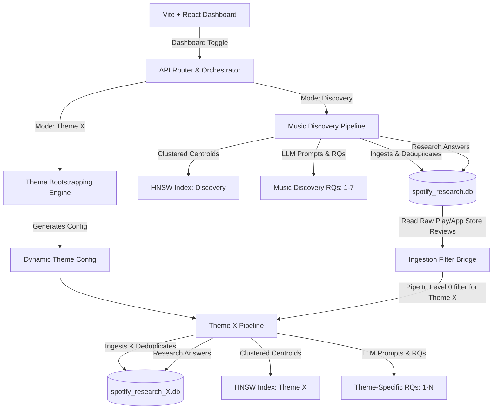
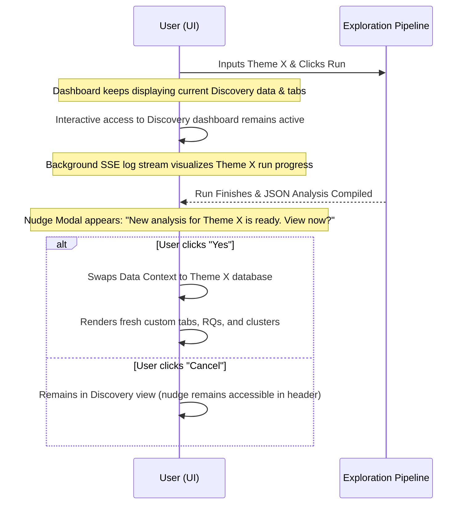
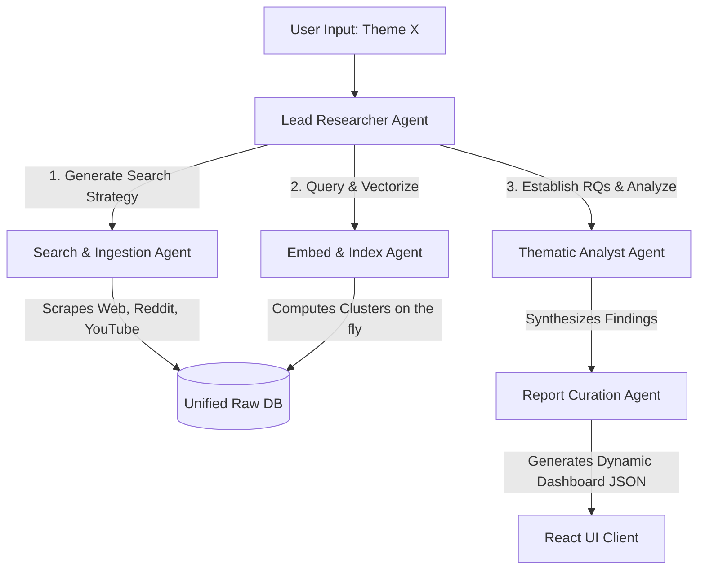
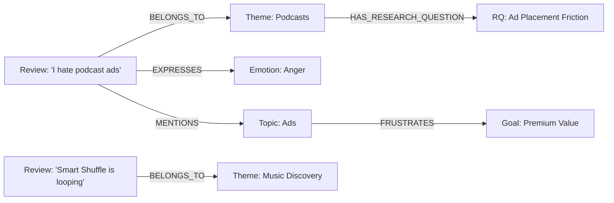

# Architectural Blueprint: Isolated Dynamic Theme Exploration Engine

This document provides a comprehensive architectural proposal for introducing a **Theme Exploration Mode** into the Spotify Product Research Engine. It details how the system can dynamically adapt to any user-defined theme $X$ (e.g., Podcasts, Ads, AI DJ, Premium, Playlists) in a fully isolated sandbox, ensuring zero disruption or data contamination to the core **Music Discovery** pipeline.

---

## 1. System Topology & Dual-Mode Isolation

To guarantee that the **Music Discovery** pipeline and the new **Theme $X$ Exploration** pipeline never share databases, vector indexes, caches, research questions, or dashboards, we propose a **Dynamic Multi-Tenant Architecture**. 

The system operates under a **shared-code, isolated-state** paradigm:



### Architectural Safeguards for Complete Isolation:
1. **Dynamic Database Provisioning**: In Mode 2, when the user inputs theme $X$, the orchestrator creates a slugified identifier (e.g., `podcasts` -> `spotify_research_podcasts.db`). All SQLite tables, persistent embeddings, pipelines, and caches are written exclusively to this new file.
2. **Independent Vector Space & HNSW Indexes**: Centroid indexes and HNSW databases are instantiated per database. This ensures that the vector spaces (and their dimensions/mean similarities) are entirely localized to theme $X$.
3. **Separate SSE Stream Channels**: Live log broadcasting and progress counters are segmented via SSE channel query parameters (e.g., `/api/stream?mode=discovery` vs. `/api/stream?mode=theme_x&theme=podcasts`), preventing UI updates from overlapping.

---

## 1.5. Contamination Risk Analysis: Shared Database vs. Silos

### The Risk of a Single Tagged Database:
If we were to use a single unified database where records are simply tagged with their theme (e.g., `theme = 'discovery'` vs. `theme = 'podcasts'`), the **cumulative analysis for the discovery dashboard is at high risk of semantic and operational contamination**:

* **Query-Level Leaks**: Cumulative calculations in the dashboard (such as overall volumes, average ratings, and location statistics) query the database broadly. If any developer or pipeline script forgets to append the `AND theme = 'discovery'` filter to a query, non-discovery data will instantly pollute the discovery metrics.
* **Vector Index Contamination**: Standard vector indexing libraries (like HNSWLib) index the entire table. If vectors for all themes are stored together, nearest-neighbor searches during clustering will pull in reviews from other themes unless separate indexes are filtered, maintained, and loaded. Maintaining segmented indices inside a single file adds unnecessary complexity.
* **c-TF-IDF Vocabulary Distortion**: The term weights in Class-Based TF-IDF are calculated using frequencies across the entire corpus. If the background corpus includes terms from other themes (e.g., podcast episodes, ad timings), the inverse document frequency (IDF) for shared words shifts. This directly warps the generated key themes of your core Music Discovery dashboard.
* **LLM Cache and Summary Corruption**: Background processes that summarize clusters or answer Research Questions dynamically cache results by hashing database inputs. Sharing tables risks cache key collision or summary pollution if the boundaries of a cluster are not perfectly insulated.

**Verdict**: Relational database-level isolation (separate files) is the only bulletproof way to guarantee that cumulative discovery analytics are 100% protected from pollution.

---

## 1.9. Summary of Phase Changes (Added vs. Modified)

Below is the definitive list of new phases added and existing phases modified under this proposed architecture:

### Added Phases (New)
* **Pre-Phase 1: Theme Bootstrapping & LLM Configuration Generator**: A brand-new phase that uses `gemini-2.5-flash` to dynamically generate theme-specific configuration schemas (theme-focused search queries, anchors, and research questions) before ingestion starts. The subreddits list is always fixed to `["spotify", "truespotify", "spotifyplaylist"]` to focus data collection on the core Spotify product, while YouTube search queries are strictly prefixed with `"spotify "` and limited to exactly 3 highly specific keywords.

### Modified Phases (Changed)
* **Phase 1: Ingestion & Filter Bridge**: Modified to support dynamic target ingestion and run storefront review ingestion from a staging database `spotify_raw_shared_replica.db` using isolated API keys (`THEME_X_APIFY_API_TOKEN`, etc.).
* **Phase 3: Theme-Aware Embedding & SAP**: Refactored to dynamically reset the anchor vector space and embed new anchors on-the-fly.
* **Phase 4: Adaptive Clustering & LLM Synthesis**: Updated to use isolated database files (`spotify_research_{theme}.db`), apply volume-based adaptive clustering thresholds, and route to theme-specific research questions. This incorporates execution checkpoints like Level 2.5 Cluster Intelligence (Phase 3.5), Level 3.5 Deep Refinement (Phase 4.5), and Level 3.7/3.8 compilation (Phase 4.7/4.8) inside the isolated database environments.
* **Phase 5: Dynamic Dashboard Presentation & UX Flow**: Upgraded to support a dual-mode toggle, non-blocking background runs with log streaming, a completion nudge, and dynamic API routing (`/api/exploration/{theme_slug}`).

---

## 2. Pre-Phase 1: Theme Bootstrapping & LLM Configuration Generator

Instead of hardcoding scraper keywords, routing targets, research questions, or semantic anchors, Mode 2 utilizes a **Theme Bootstrapping Engine** powered by `gemini-2.5-flash`. When a theme $X$ is entered, the engine runs a single preprocessing step to construct a **Dynamic Theme Configuration Schema (JSON)**.

To focus feedback collection on the core Spotify product and ensure high relevance, the target subreddits list is kept permanently fixed to `["spotify", "truespotify", "spotifyplaylist"]` (not generated by the LLM). The LLM instead generates exactly 3 highly specific, theme-focused search queries for YouTube, Reddit, and the Spotify Forums. Each YouTube search query is strictly prefixed with the word `"spotify "` (e.g., `"spotify podcast update"`).

```json
{
  "theme": "Podcasts",
  "theme_slug": "podcasts",
  "scraping_elements": {
    "reddit_subreddits": ["spotify", "truespotify", "spotifyplaylist"],
    "reddit_search_queries": ["spotify podcast issues", "best podcast player spotify", "spotify podcast ads"],
    "youtube_search_queries": ["spotify podcast update", "spotify video podcasts", "spotify podcast ads"],
    "spotify_community_keywords": ["podcast offline", "podcast playback", "podcast queue"]
  },
  "level_0_config": {
    "priority_routing_keywords": ["podcast", "podcasts", "episode", "episodes", "show", "shows", "host", "playback speed"]
  },
  "semantic_anchors": {
    "goal_listen": "listen to podcasts episodes stories talk shows",
    "goal_discover": "find new shows discover creators podcast recommendations",
    "context_car": "driving carplay android auto bluetooth road trip",
    "context_home": "smart speaker casting sonos speaker casting audio Alexa",
    "frustration_playback": "playback error buffering offline sync speed control skip seconds",
    "frustration_ads": "host-read ads premium ads unskippable sponsored segments",
    "frustration_navigation": "search episodes show feed latest episode catalog library",
    "churn_indicator": "switching to Apple Podcasts Pocket Casts YouTube leaving spotify"
  },
  "research_questions": {
    "TRQ1": {
      "title": "Podcast Discoverability & Feed Friction",
      "question": "How do users navigate and discover new podcast shows, and what barriers exist in the show recommendations feed?"
    },
    "TRQ2": {
      "title": "Audio/Video Playback Performance",
      "question": "What technical and UX issues (e.g., sync, offline downloads, speed) disrupt the playback experience for audio and video podcasts?"
    },
    "TRQ3": {
      "title": "Monetization and Podcast Advertising",
      "question": "How do Premium users feel about podcast-specific ads, and how does ad placement affect user retention?"
    },
    "TRQ4": {
      "title": "Platform Competition & Churn Triggers",
      "question": "What features drive users to switch from Spotify to dedicated podcast apps like Apple Podcasts or Pocket Casts?"
    }
  }
}
```

### Execution Strategy:
* **Caching**: The generated JSON is saved in a master coordinator database under a `theme_configurations` table. If the user toggles back to a previously searched theme, the configuration is loaded instantly in under 10ms.
* **Fallback Mechanisms**: If the LLM generation fails or times out, the system loads a template schema where keyword matching defaults to basic string containment of $X$ and default research questions default to standard product usability templates.

---

## 3. Phase 1: Ingestion & Filter Bridge

The ingestion pipeline handles the two types of reviews differently:

### A. Dynamic Target Ingestion (Reddit, YouTube, Spotify Forums)
The scraper workers are initialized using the generated `scraping_elements` from the Theme Configuration:
1. **Reddit Scraper**: Targets the generated subreddits and queries, utilizing the concurrent partitioned scraping mechanism.
2. **YouTube Scraper**: Pulls comments from videos matching the search queries (e.g., looking up videos matching "spotify podcast update").
3. **Forums Scraper**: Paginate Spotify Community forums targeting the generated search terms.

### B. Shared API Key Configuration & Parallel Execution Policy
To optimize ingestion throughput and avoid rate limits across both **Discovery Mode** and **Theme $X$ Exploration Mode**, all pipelines share a common pool of 3 API keys for each external service. These are configured in the single shared `backend/.env` file:

* **Apify Scraper Keys**: `APIFY_API_TOKENS` containing 3 comma-separated keys.
* **Gemini Orchestration Keys**: `GEMINI_API_KEYS` containing 3 comma-separated keys.
* **Groq Synthesis Keys**: `GROQ_API_KEYS` containing 3 comma-separated keys.
* **YouTube Scraper Key**: `YOUTUBE_API_KEY` (standard shared key).

#### Concurrency & Partitioning Rules for Theme Exploration Ingestion:
1. **Parallel Partitions**: The 3 fixed subreddits (`spotify`, `truespotify`, `spotifyplaylist`) are divided into 3 concurrent scraper partitions running simultaneously in parallel.
2. **Key Rotation & Concurrency**: Each parallel scraper partition runs with a different key from the shared `APIFY_API_TOKENS` list, executing simultaneously to fetch reviews.
3. **Strict Limit**: To preserve credits, prevent rate-limiting, and optimize speed, each partition's run is strictly capped at fetching **exactly 200 reviews** per subreddit.

### C. Shared Raw Replica Store (Google Play & Apple App Store reviews)
To reuse storefront reviews without ever touching the primary Music Discovery database (`spotify_research.db`), we implement a **Shared Raw Replica Store** architecture:

1. **Decoupled Replica Creation**: At the start of any new theme pipeline run, the system creates a read-only copy of the raw storefront reviews (Google Play and App Store records only) and exports them to a shared staging database: `spotify_raw_shared_replica.db`. The core database is immediately disconnected and remains completely isolated from other theme runs.
2. **Filter & Ingest from Replica**:
   - The Theme $X$ pipeline connects exclusively to `spotify_raw_shared_replica.db` to pull historical reviews.
   - It streams the raw reviews from the replica through the new **Theme-Aware Level 0 Preprocessing Pipeline**.
   - A review is saved into `spotify_research_X.db` only if it passes the new theme's keyword filters or semantic thresholds.
3. **Key Architectural Benefits**:
   - **Zero Lock Contention**: SQLite uses file-level locking. Offloading custom reads to `spotify_raw_shared_replica.db` ensures that bulk operations in other themes never lock or slow down the live Music Discovery dashboard.
   - **Absolute Corrupt Security**: No custom theme pipeline can write to, modify, or corrupt the primary database file.
   - **Network Efficiency**: Retains the performance benefit of bypassing App Store and Google Play API/scraping endpoints for historical baseline data.

---

## 4. Phase 3: Theme-Aware Embedding & SAP

### Dynamic Semantic Anchor Projection (SAP)
In the existing architecture, the `SemanticAnchorProjector` uses a hardcoded dictionary `ANCHOR_PHRASES`. 
In Mode 2, this is upgraded to **Dynamic SAP**:
1. **Rebuild Anchors from Scratch**: When a completely different theme is selected, the system **completely wipes the anchor vector space** and builds every single semantic anchor from scratch. None of the core music discovery anchors are carried over or reused.
2. **Dynamic Embedding Generation**: The bootstrapping LLM defines a brand-new set of 15-20 anchor phrases (covering theme-specific goals, frustrations, workarounds, features, contexts, and competitors). At pipeline startup, the embedding engine (`all-MiniLM-L6-v2` via ONNX) embeds these new anchor phrases.
3. **Local Vector Projection**: During the Level 2 pipeline, each incoming review vector is projected against these fresh, theme-specific anchors.
4. **Contextual Tagging**: This dynamically classifies reviews based strictly on theme-specific contexts (e.g., identifying "host-read ads" as a podcast frustration, or "playback speed" as a podcast goal), with zero reference to discovery tags.

---

## 5. Phase 4: Adaptive Clustering & LLM Synthesis

Once reviews are embedded and projected, they flow into the isolated clustering and synthesis engines:
1. **Centroid Indexing**: An isolated HNSW centroid index is built for theme $X$. Clusters split and merge using the same mathematical variance checks, but thresholds scale based on the specific count of the theme's reviews ($N_X$).
2. **Cluster Intelligence (Level 2.5)**: The `gemini-2.5-flash` model runs on milestone sizes, generating sub-issues focused on theme $X$. Using the 3 shared `GEMINI_API_KEYS` in parallel, the orchestrator dispatches batch cluster intelligence requests simultaneously to synthesize sub-issues efficiently without triggering rate limits.
3. **Research Question Routing & Synthesis (Level 3)**:
   - The orchestrator maps the theme's semantic clusters to the dynamic `research_questions` generated during bootstrapping.
   - The LLMs (`llama-3.3-70b` via Groq using the 3 shared `GROQ_API_KEYS` simultaneously, or Gemini using `GEMINI_API_KEYS` simultaneously) synthesize answers to these custom questions in parallel.
   - The compiled results are saved into an isolated `research_answers` table in `spotify_research_X.db`.

---

## 6. Phase 5: Dynamic Dashboard Presentation & UX Flow

To provide a seamless, non-blocking user experience, the frontend dashboard is divided into two distinct views controlled by a toggle system.

### A. Main View & Toggle Setup
* **Default Mode**: The dashboard loads into the default **Spotify Music Discovery Dashboard** (Mode 1), displaying the core music discovery cumulative metrics, clusters, and RQs.
* **Theme Exploration Toggle**: The header features a clearly visible mode toggle with an explanatory label:
  > *“The default dashboard pipeline is purpose-built and optimized strictly for Spotify Music Discovery research. Toggle this mode to explore custom themes (e.g., Podcasts, AI DJ, Ads, Premium, Playlists) without affecting the core discovery dataset.”*
* **Dynamic Theme Input**: Toggling opens a text input field where the user specifies custom theme $X$ and clicks "Run Exploration".

### B. In-Progress & Active Transition UX Pipeline
To avoid leaving the user on a blank or generic loading screen during processing, the following state machine is enforced:



1. **Placeholder Phase (Run Triggered)**: While the background pipeline for theme $X$ is actively compiling data, the UI continues to show the **existing cumulative Discovery dashboard** with all its tabs (Clusters, Research, Friction) fully interactive. An overlay progress bar/live terminal panel shows real-time pipeline status (Ingestion, Embedding, Clustering, Synthesis).
2. **The Completion Nudge**: Once the exploration pipeline completes the synthesis and writes it to `spotify_research_{theme}.db`, the UI receives a WebSocket/SSE notification and triggers a prominent nudge:
   > **“New analysis for theme [X] is ready. Would you like to view the analysis?”** (Buttons: `[Show Analysis]` / `[Keep Current View]`)
3. **Dynamic Context Swap**: Upon confirmation (`Show Analysis`), the dashboard dynamically redirects its API calls to the exploration endpoint, refreshing all visual panels (2D clusters, dynamic SAP metrics, and custom RQs) with the theme $X$ dataset.

### C. Backend API Redirection Matrix

| Dashboard Element | Mode 1 (Music Discovery) | Mode 2 (Theme $X$ Exploration - Active) |
| :--- | :--- | :--- |
| **API Base Path** | `/api/discovery/*` | `/api/exploration/{theme_slug}/*` |
| **Data Context** | Reads `spotify_research.db` | Reads `spotify_research_{theme}.db` |
| **SSE Logs** | Stream: `/api/stream?mode=discovery` | Stream: `/api/stream?mode=exploration&theme={theme}` |
| **Visual Clusters** | 2D projection of Discovery centroids | 2D projection of Theme $X$ centroids |
| **Research Tab** | Displays 7 core music discovery RQs | Displays dynamically generated Theme $X$ RQs |
| **Friction / Anchors** | Displays repetition, car play, gym tags | Displays theme-specific SAP tags (e.g., playback, video sync) |

---

## 7. Comparative Design: AI-Native Agentic Architectures

While cloning the multi-tiered architecture into isolated database silos is a robust and deterministic engineering pattern, we can explore two advanced **AI-Native alternative designs** that reduce code complexity and enhance insight quality.

### Alternative A: The Agentic Research Network (Dynamic Multi-Agent System)
Instead of copying database structures and running structured pipelines, we utilize a team of autonomous agents operating under a hierarchical research coordinator:



#### Why this is better:
* **Zero Hardcoded Schema Maintenance**: We do not need separate databases or schema migrations. The agents query a single, unified database using SQL statements generated at runtime.
* **Self-Improving Scraping**: If the Search Agent notices that a subreddit has no active discussions on theme $X$, it dynamically adjusts its search query and scans alternative sources (e.g., Twitter, Medium) without manual code modification.
* **Semantic Query-Time Partitioning**: Instead of isolating databases, reviews are tagged with metadata `{ "theme_association": { "podcasts": 0.89, "discovery": 0.12 } }`. Isolation is handled at the query level, allowing the same reviews to be reused across overlapping themes (e.g., a review complaining about "podcast discovery" is accessible to both modes).

---

### Alternative B: Ontology-Driven Semantic Knowledge Graph
Instead of relational databases and tabular data models, the entire system is built on a **Knowledge Graph** (e.g., Neo4j or SQLite Graph extension) using semantic embeddings:



#### Why this is better:
* **Dynamic Relationship Mapping**: Instead of mapping clusters to research questions via manual heuristics, the graph naturally establishes links based on shared topics and semantic entities.
* **Cross-Thematic Insights**: The engine can perform graph pathfinding queries. For example, it can answer: *"How does ad frustration in podcasts compare to ad frustration in music discovery?"* This is impossible in completely isolated Relational Databases.
* **Graph-Based Summarization**: The Research Engine synthesizes answers by performing a **sub-graph extraction** for theme $X$ and feeding the dense entity network to Gemini, yielding highly structured, network-aware product suggestions.


---

## 8. In-Process Exploration Optimization & LLM Concurrency Control Layer

To support rapid theme bootstrapping and dynamic analysis of custom exploration targets without rate-limiting penalties or process startup delays, Mode 2 utilizes the exact same in-process execution topology, API key semaphores, and SHA-256 package-level caching defined in the core architecture:
*   **In-Process Exploration Runs**: Triggering a new Theme Exploration pipeline calls the importable async runners (e.g. `run_clustering_pipeline(...)`, `run_cluster_intelligence_pipeline(...)`, etc.) in-process, capturing standard output and loguru streams and routing them directly to the dynamic exploration stream channel (`/api/stream?mode=exploration&theme={theme}`).
*   **Theme Caching Isolation**: The SHA-256 evidence package and RQ hashes check the `llm_cache` table residing inside the isolated database file `spotify_research_{theme}.db`. This guarantees that cache hits are isolated to the specific theme context and never overlap with music discovery cache states.
*   **Throttling**: Dynamic exploration tasks share the concurrent semaphore pool to maintain safety across concurrent research requests.

---

## 9. Automated Ingestion & Analytics Scheduler (GitHub Actions)

To maintain a fresh, up-to-date dashboard without manual trigger dependencies or continuous server background process costs, the system incorporates a serverless automated scheduler.

### A. Scheduler Topology & Trigger Cadence
*   **Trigger Cadence**: Runs automatically on the **1st and 15th of every month** at **10:00 AM Indian Standard Time (IST)**. This is mapped directly to **4:30 AM UTC** inside the GitHub Actions cron workflow scheduler.
    *   *Cron Expression*: `30 4 1,15 * *`
*   **Target Scope**: The scheduler operates exclusively on the **Discovery Engine** (Mode 1 / core database) to continuously refresh the main dashboard views.
*   **Execution Platform**: GitHub Actions runner virtual machines (Ubuntu-latest).

### B. Ingestion Limits and Source Configuration
Every scheduler run triggers a controlled scrape with the following limits:
*   **Google Play Store**: Max `800` reviews.
*   **Reddit**: Max `200` reviews.
*   **YouTube Comments**: Max `100` comments.
*   **Spotify Community Forums**: Max `100` posts.
*   **Apple App Store**: Disabled (`0` reviews).
*   **Total Max Ingestion Limit**: `1,200` reviews per run.

### C. Self-Healing Integration & "Last Updated" Date Resolution
1.  **State Extraction**: The scheduler script connects to the production Postgres database (Railway) and runs an SQL query to extract the maximum review timestamp currently recorded:
    ```sql
    SELECT MAX(timestamp) FROM reviews;
    ```
2.  **Date Window Resolution**: The returned timestamp is set as the dynamic `from_date` (starting date), and the current trigger execution date is set as `to_date`.
3.  **Deduplicated Scraping**: The scrapers fetch reviews strictly within this window, preventing duplicate rows and maintaining 100% data consistency.
4.  **Processing & Compilation**: The script triggers classification, sentence embeddings vector projection, clustering, and research engine synthesis.
5.  **Logging**: The execution details (volume of reviews ingested, timestamps, status) are logged to the `pipeline_runs` table, which the Vercel frontend queries to display the **"Last Updated"** date in the dashboard UI.


